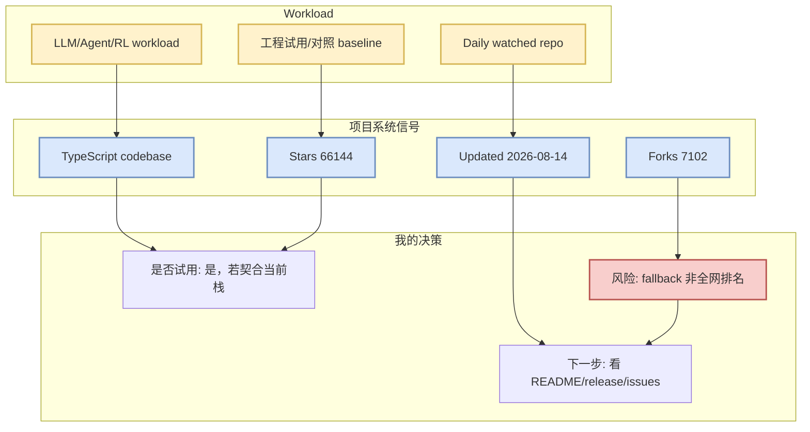

# cline/cline

> 一句话结论：这是今日 direct watched-repo fallback 中的高信号项目；当前星标 66144，日增标注为“direct watched repo fallback vs most recent snapshot，非完整全网日增”。

## TL;DR

- Repo：[cline/cline](https://github.com/cline/cline)
- Stars / Forks：66144 / 7102
- Language：TypeScript
- Updated：2026-08-14
- Topics：未标注
- 可信度：GitHub direct `/repos` 元数据；Search API 今日 403，因此不是完整全网排名。

## 信息压缩图示

## 机制/影响矩阵

| 维度 | 判断 | 对我的影响 |
|---|---|---|
| Infra 相关性 | Autonomous coding agent as an SDK, IDE extension, or CLI assistant. | 可作为 serving/training/agent loop 观察样本 |
| 增长信号 | stars_delta=126 | 仅代表 watched-repo fallback，不是全网真实榜 |
| 工程动作 | 查看 docs/examples/release | 判断是否进入本地 spike |

## 专业解读

Autonomous coding agent as an SDK, IDE extension, or CLI assistant.。对 AI Infra/LLM 工程而言，重点不是单日 star 数本身，而是它是否处在模型接入、推理 runtime、agent loop 或训练后链路的关键位置。

## 通俗解释

把它当作今天“值得保持雷达回波”的项目：如果后续 release 或 issue 显示具体功能突破，再升级为必读/试用。

## 可信度与局限性

- GitHub Search API 今日 403，本文来自 direct GET watched repo fallback。
- star 增长为和历史 snapshot 的交叉对比；若 baseline 缺失则为冷启动代理。

## 我应该如何跟进

1. 打开 repo README 和 release。
2. 若涉及 serving/agent runtime，做 30-60 分钟 spike。
3. 与 vLLM/SGLang/Claude Code/Codex 等现有 baseline 对比。

## 相关链接

- 原文：https://github.com/cline/cline
- Daily：[[Daily/2026-08-14]]

#ai-radar #github #direct-fallback
