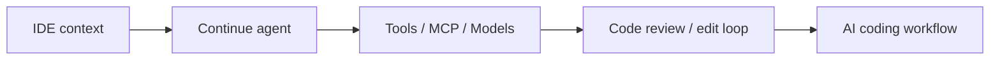

# continuedev/continue

> 日期：2026-08-15
> 来源类型：GitHub repository / Loop Engineer watched repo
> 原文：https://github.com/continuedev/continue

## 一句话结论
Continue 是开源 IDE/CLI coding-agent 观察对象，适合对照 Claude Code、Codex、Cline 的上下文、权限和 IDE 集成模式。

## 信息压缩图示

## 影响矩阵
| 维度 | 判断 |
|---|---|
| Loop Engineering | 高 |
| IDE 集成 | 高 |
| 试用建议 | 对照本地多 agent workflow |

## 相关链接
- Daily：[[Daily/2026-08-15]]
- 原文：https://github.com/continuedev/continue

#ai-radar #loop-engineering
