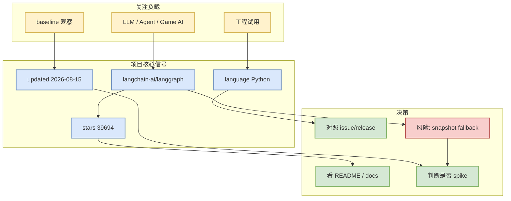

# langchain-ai/langgraph

> 日期：2026-08-15
> 来源类型：GitHub repository / direct watched-repo fallback
> 原文：https://github.com/langchain-ai/langgraph

## 一句话结论
langchain-ai/langgraph 是今日 AI Radar watched-repo 信号之一；在 GitHub Search 受限时用于维持 AI Infra / Loop Engineering / Point Rummy 的连续观察基线。

## TL;DR
- Stars：39694；Forks：6665；语言：Python。
- 更新：2026-08-15T01:04:12Z；topics：agents, ai, ai-agents, chatgpt, deepagents, enterprise, framework, gemini, generative-ai, langchain, langgraph, llm, multiagent, open-source, openai, pydantic, python, rag。
- 摘要：Build resilient agents.
- 增长：58；依据：direct watched repo fallback vs most recent snapshot，非完整全网日增。

## 元信息
| 字段 | 值 |
|---|---|
| repo | `langchain-ai/langgraph` |
| 来源类型 | GitHub repository |
| stars / forks | 39694 / 6665 |
| language | Python |
| updated_at | 2026-08-15T01:04:12Z |
| 原文 | https://github.com/langchain-ai/langgraph |

## 信息压缩图示

## 影响矩阵
| 维度 | 判断 | 对我的影响 |
|---|---|---|
| AI Infra / Serving | 中 | 可用于推理、训练或平台 baseline 观察 |
| Loop Engineering | 高 | 可对照 coding-agent loop、MCP、harness、eval loop |
| RL / Game AI | 低到中 | 可作为规则、bot、仿真或评测参考 |
| 可信度 | 中：direct repo/API + snapshot fallback | Search 403 时不能宣称全网排名 |

## 专业解读
这个条目的价值不在于单日 headline，而在于作为可重复观测的工程基线：stars、forks、updated_at 和 release/issue 活跃度可以辅助判断生态热度。若它位于 serving/training 栈，应优先检查 scheduler、KV cache、kernel、distributed runtime；若位于 coding-agent 栈，应优先检查 CLI/TUI、权限、MCP、IDE 集成与评测 loop。

## 通俗解释
这是一个今天被雷达扫到的重点开源项目。因为 GitHub 搜索额度受限，日报把它作为“固定观察名单”来保证趋势不中断，但不会把它包装成完整全网排名。

## 我应该如何跟进
1. 打开原文看 README、release、examples。
2. 若与当前工程相关，做 30-60 分钟 spike。
3. 明日对照 stars_delta 和 release 变化。

## 相关链接
- 原文：https://github.com/langchain-ai/langgraph
- Daily：[[Daily/2026-08-15]]

#ai-radar #github #watchlist
