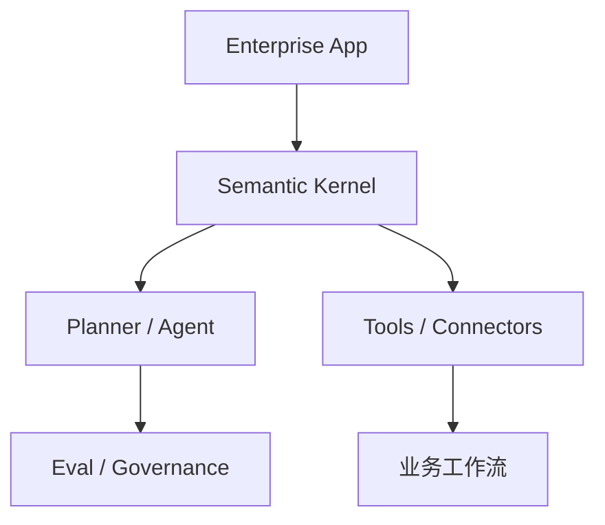

# microsoft/semantic-kernel

> 日期：2026-08-15
> 来源类型：GitHub repository / Loop Engineer watched repo
> 原文：https://github.com/microsoft/semantic-kernel

## 一句话结论
Semantic Kernel 是 Microsoft agent / enterprise LLM orchestration 观察对象，适合跟踪多 agent、tool calling、企业集成与 SDK 形态。

## 信息压缩图示

## 影响矩阵
| 维度 | 判断 |
|---|---|
| Agent framework | 中高 |
| Enterprise integration | 高 |
| 与 coding loop 关系 | 可参考 orchestration 与 tool abstraction |

## 相关链接
- Daily：[[Daily/2026-08-15]]
- 原文：https://github.com/microsoft/semantic-kernel

#ai-radar #loop-engineering
