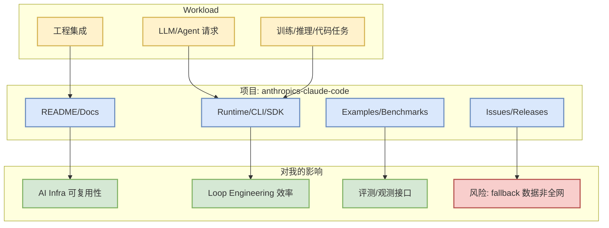

# anthropics/claude-code - 2026-08-24

> 一句话结论：anthropics/claude-code 是今日 AI Radar watched set 中的 Loop Engineer / coding-agent loop 关键 watched repo，本页用于快速判断是否值得试用/持续跟踪。

## TL;DR
- stars / forks：142761 / 22855
- language：Python
- updated_at：2026-08-24T01:03:21Z
- 重点：Claude Code is an agentic coding tool that lives in your terminal, understands your codebase, and helps you code faster by executing routine tasks, explaining complex code, and han…
- 决策：值得小规模试用

## 元信息表
| 字段 | 内容 |
|---|---|
| 来源 | GitHub |
| 来源类型 | direct watched repo fallback / GitHub Repository |
| repo | [anthropics/claude-code](https://github.com/anthropics/claude-code) |
| stars | 142761 |
| forks | 22855 |
| language | Python |
| updated_at | 2026-08-24T01:03:21Z |
| topics | 未标注 |
| benchmark/docs/examples/release | 需进入 repo README / release 复核 |

## 信息压缩图示

## 机制 / 影响矩阵
| 维度 | 判断 | 对用户的意义 |
|---|---|---|
| AI Infra | Loop Engineer / coding-agent loop 关键 watched repo | 影响 serving、training、agent runtime 或代码工作流 |
| 可落地性 | 高 | 可先看 README、examples、release，再决定是否接入 sandbox |
| 可信度 | 中 | 今日 GitHub Search 403，使用 direct watched repo fallback，不代表完整全网排名 |
| 风险 | 版本/接口变化、benchmark 需复核 | 不应只凭 stars 选型，需要结合真实 workload 测试 |

## 专业解读
Claude Code is an agentic coding tool that lives in your terminal, understands your codebase, and helps you code faster by executing routine tasks, explaining complex code, and handling git workflows - all through natural language commands.。对 AI Infra 工程师而言，优先检查它是否提供稳定 API、benchmark、GPU/推理/agent loop 相关 examples；对 RL/Game AI 方向，优先看是否能抽象成环境、评测器或自动化 loop。

## 通俗解释
可以把它当作今天雷达里的一个“固定观察点”：即使 GitHub 搜索限流，仍需要知道这些关键仓库有没有明显增长或更新。

## 我应该如何跟进
1. 打开 repo release / README，确认近 7 天是否有 breaking change。
2. 如果涉及 serving/training，跑最小 benchmark；如果涉及 coding-agent，放入 tmux 多 agent 工作流 sandbox。
3. 明天与新的 snapshot 对比 stars_delta，避免把 fallback 误当作全网趋势。

## 相关链接
- 原文：https://github.com/anthropics/claude-code
- 今日日报：[[Daily/2026-08-24]]

#ai-radar #github #direct-fallback
