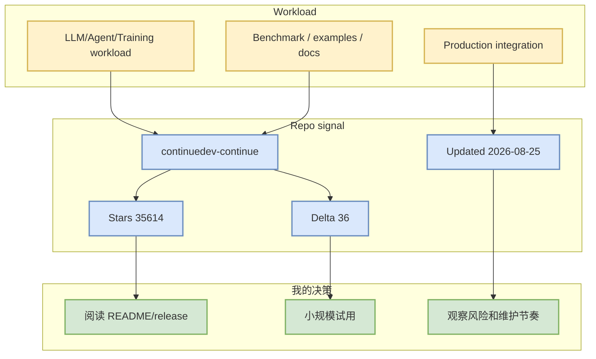

# continuedev/continue - 2026-08-25

> 一句话结论：continuedev/continue 是今日 LoopEngineer watched-set 的连续观测项；当前榜单来自 direct/历史 snapshot fallback，适合做趋势跟踪，不等同完整 GitHub 全网榜。

## TL;DR
- Stars：35614；Forks：5282；Language：TypeScript。
- 最近更新：2026-08-25T00:22:48Z；日增：36；依据：direct watched repo fallback / 非完整全网日增。
- 重点：open-source coding agent
- 原文：https://github.com/continuedev/continue

## 元信息
| 字段 | 值 |
|---|---|
| repo | continuedev/continue |
| stars / forks | 35614 / 5282 |
| language | TypeScript |
| topics | agent, ai, cli, developer-tools, open-source |
| updated_at | 2026-08-25T00:22:48Z |
| pushed_at | 2026-08-24T16:42:22Z |
| 来源类型 | GitHub repository / watched repo fallback |
| 原文 | https://github.com/continuedev/continue |

## 信息压缩图示

## 影响矩阵
| 维度 | 判断 | 对我的影响 |
|---|---|---|
| AI Infra / LLM | 中 | 可对 serving、training、agent runtime 做候选跟踪 |
| Loop Engineering | 高 | 可影响 coding-agent loop、工具调用、上下文工程或评测 harness |
| Point Rummy / Game AI | 低 | 可抽取规则、bot baseline、simulator/evaluator 思路 |
| 可信度 | 中 | GitHub metadata 可信，但今日不是完整全网搜索 |

## 专业解读
open-source coding agent。对 AI Infra 工程师，重点不是单日 star 数，而是结合 updated_at、release 节奏、issue/PR 活跃度和是否有 benchmark/examples 来判断是否进入 sandbox。

## 通俗解释
把它当成“今天仍然值得放在雷达上的项目”。如果它在 serving/training/agent loop 中处于上游位置，就算今天没有重大 release，也值得保留连续观测。

## 我应该如何跟进
1. 明天对比真实 GitHub Search 是否恢复。
2. 若 delta 连续为正，检查 release notes / benchmark / breaking changes。
3. 只在小样本 workload 上试用，避免直接引入生产。

## 可信度与局限性
- 可信：repo metadata 和历史 snapshot。
- 局限：GitHub Search 403，今日 broad/growth 不是完整全网排名。

## 相关链接
- 原文：https://github.com/continuedev/continue
- 今日日报：[[Daily/2026-08-25]]

#ai-radar #github #loopengineer
