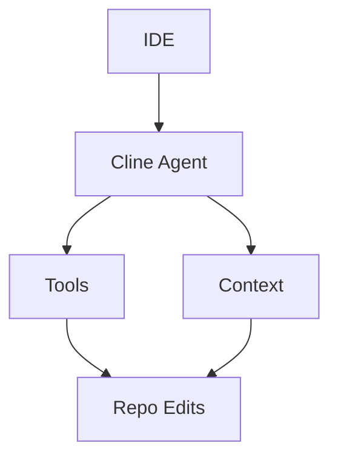
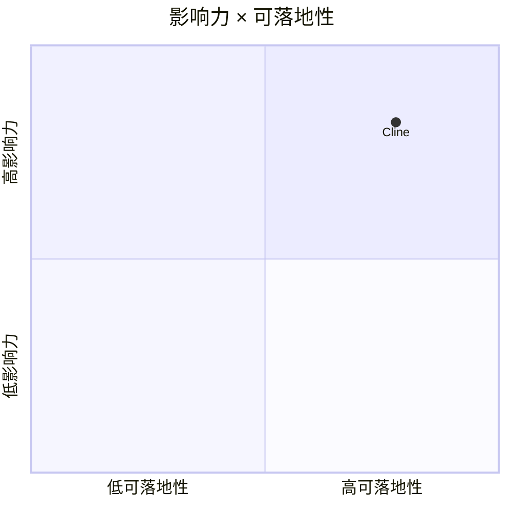

# cline/cline

> 类型：GitHub 项目
> 创建日期：2026-08-26
> 原文链接：https://github.com/cline/cline
> 返回日报：[[Daily/2026-08-26]]

## 一句话结论

Cline 是 IDE/SDK/CLI 自主编码代理的重要观察对象。

```mermaid
flowchart TB
  I[IDE] --> A[Cline Agent]
  A --> T[Tools]
  A --> C[Context]
  T --> R[Repo Edits]
  C --> R
```

```mermaid
quadrantChart
  title 影响力 × 可落地性
  x-axis 低可落地性 --> 高可落地性
  y-axis 低影响力 --> 高影响力
  Cline: [0.78, 0.82]
```

#ai-radar #cline #coding-agent
