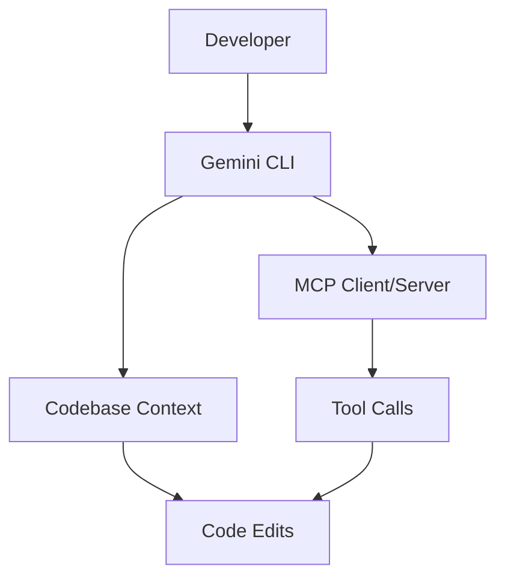
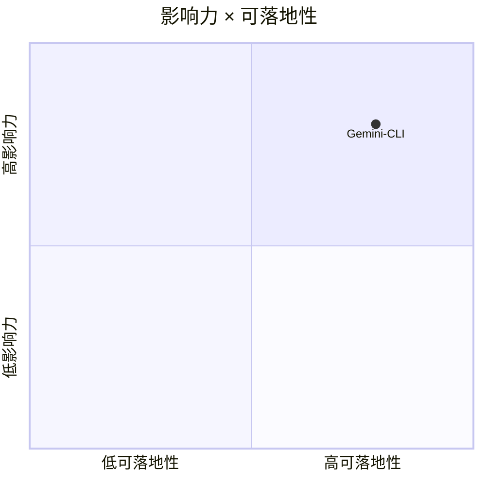

# google-gemini/gemini-cli

> 类型：GitHub 项目
> 创建日期：2026-08-26
> 原文链接：https://github.com/google-gemini/gemini-cli
> 返回日报：[[Daily/2026-08-26]]

## 一句话结论

Gemini CLI 是 Google Gemini 进入 terminal coding-agent loop 的重要入口。

## 信息压缩图示

## 对我的影响

关注 CLI/TUI、MCP、上下文管理和 Google 生态模型接入方式，评估是否适合多 agent 编程工作流。

#ai-radar #gemini #coding-agent
