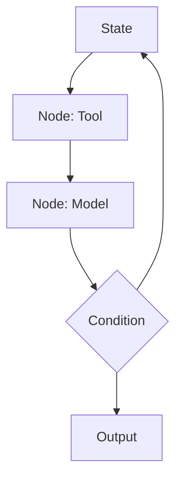
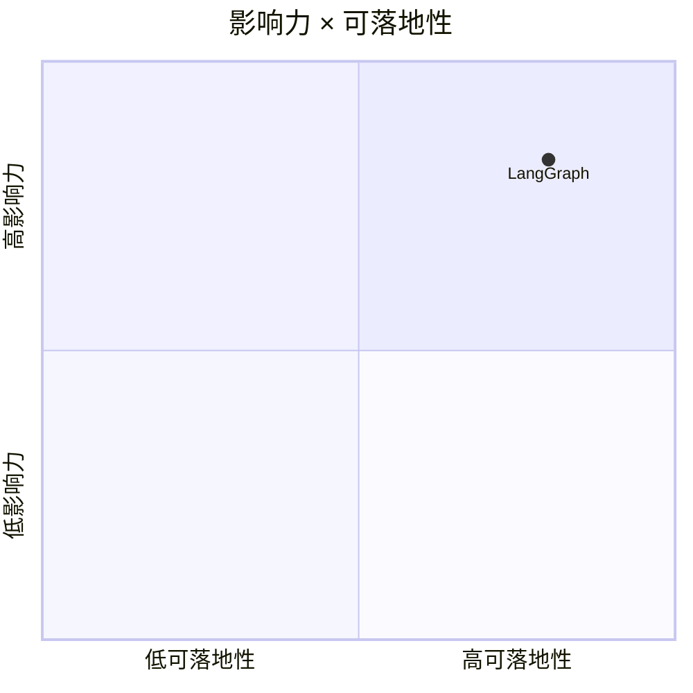

# langchain-ai/langgraph

> 类型：GitHub 项目
> 创建日期：2026-08-26
> 原文链接：https://github.com/langchain-ai/langgraph
> 返回日报：[[Daily/2026-08-26]]

## 一句话结论

LangGraph 是 agent workflow/graph 编排的高信号项目，适合观察状态、回路和恢复机制。

#ai-radar #langgraph #agent-loop
