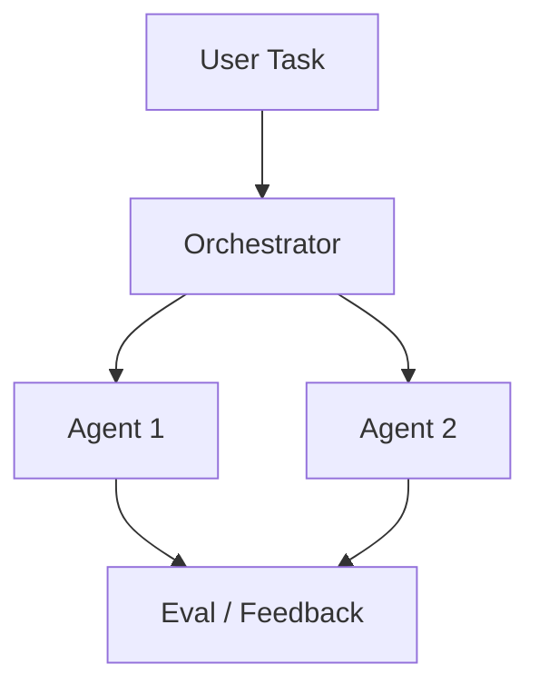
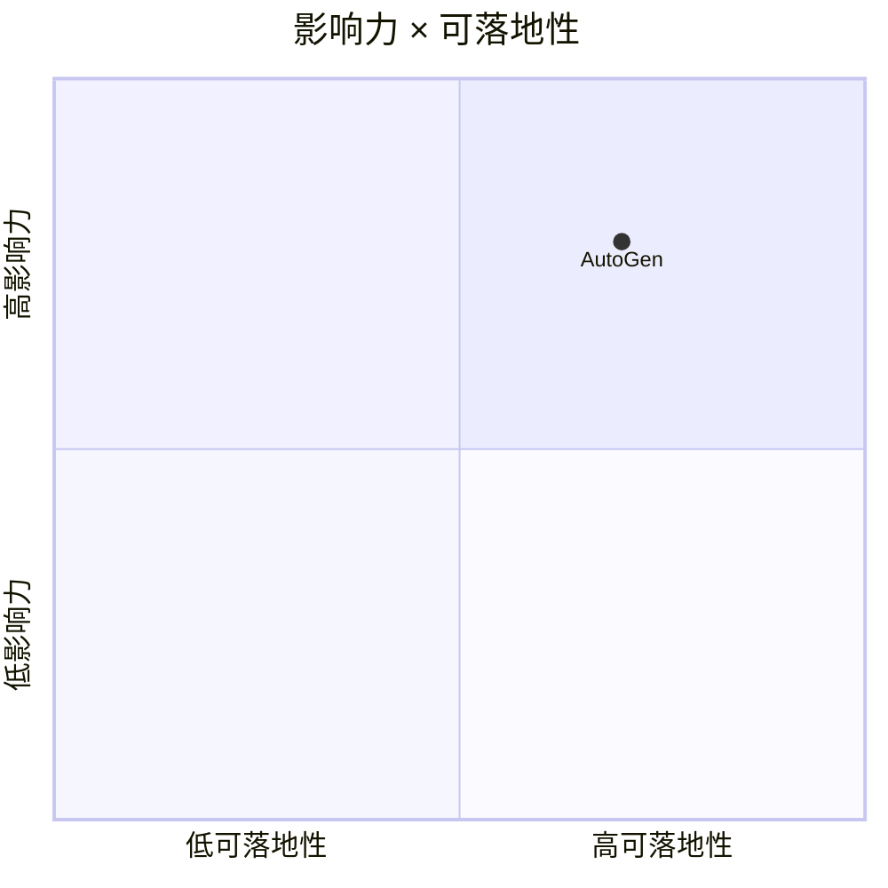

# microsoft/autogen

> 类型：GitHub 项目
> 创建日期：2026-08-26
> 原文链接：https://github.com/microsoft/autogen
> 返回日报：[[Daily/2026-08-26]]

## 一句话结论

AutoGen 是多 agent 编排与 agentic framework 的重要参考项目。

#ai-radar #autogen #multi-agent
