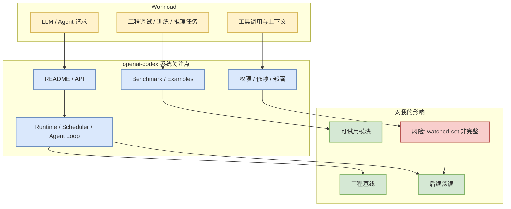

# openai/codex

> 类型：GitHub 项目
> 大类：GitHub
> 小类：AI Infra / Loop Engineering
> 推荐等级：必读
> 创建日期：2026-08-28
> 原文链接：https://github.com/openai/codex
> 网页详情：https://github.com/dyt27666-oss/AI-news-report-obsidians/blob/main/GitHub/LoopEngineer/2026-08-28/openai-codex.md
> 返回日报：[[Daily/2026-08-28]]

## 一句话结论
openai/codex 是今日 watched-set 的关键项目；本次 GitHub Search 403，因此 star 增长来自 direct `/repos` + 昨日快照的非完整全网日增。

## TL;DR
- **它是什么**：Lightweight coding agent that runs in your terminal
- **为什么重要**：对 LLM serving/training/agent loop 的工程基线有参考价值。
- **和我相关的点**：可用于对比 scheduler、runtime、MCP/tool loop、代码代理或训练栈成熟度。
- **建议动作**：今天优先 skim release / README / benchmark。

## 元信息
| 字段 | 内容 |
|---|---|
| repo | openai/codex |
| stars / forks | 118791 / 18122 |
| language | Rust |
| updated_at | 2026-08-27T01:04:38Z |
| topics | 未标注 |
| stars_delta | 0 |
| 增长依据 | direct watched repo fallback / 非完整全网日增 |
| 原文 | [GitHub](https://github.com/openai/codex) |

## 信息压缩图示

### 辅助结构：试用优先级
| 维度 | 观察点 | 建议 |
|---|---|---|
| 成熟度 | stars=118791，forks=18122 | 可作为主线基线 |
| 更新活跃 | 2026-08-27T01:04:38Z | 检查最近 release / commit |
| 工程风险 | API rate limit 下的非完整增长 | 不把 delta 当全网趋势 |

## 专业解读
这个项目进入日报不是因为单日 hype，而是因为它位于用户关注的 AI Infra / LLM / Agent 工程栈。需要重点看它如何处理运行时、上下文、工具接口、性能瓶颈、benchmark 与部署复杂度。

## 通俗解释
把它当作一个“每天固定体检”的工程标尺：即使 GitHub 搜索挂了，也能知道核心仓库有没有明显变化。

## 关键机制拆解
| 机制 | 解决的问题 | 为什么有效 | 可能的坑 |
|---|---|---|---|
| watched repo 直连 | Search 403 时保持连续性 | `/repos` 直接接口仍可用 | 不是全网趋势 |
| stars_delta | 观察热度变化 | 和昨日快照对比 | baseline 缺失会失真 |
| README/release skim | 快速定位可落地变化 | 聚焦 API/benchmark | release body 需人工复核 |

## 对我的影响
| 维度 | 影响 | 建议动作 |
|---|---|---|
| AI Infra | 提供组件或对标基线 | skim README / benchmark |
| LLM 工程 | 可能影响 serving/training/agent workflow | 看 examples |
| RL / Game AI | 间接影响训练平台或 agent harness | 暂存 |
| Agent / Eval | 若含 agent/tool loop，值得深入 | 跟踪 release |

## 可信度与局限性
- 证据强度：GitHub direct metadata 高，增长排名低置信。
- 局限性：未完整读取 README 和 release body。
- 还需要确认：是否有 benchmark、稳定版本和破坏性变更。

## 我应该如何跟进
1. 打开原仓库检查 README / release。
2. 对关键项目记录 benchmark 与 deployment requirements。
3. 若和当前工程栈重合，安排 spike。

## 相关链接
- 原文：https://github.com/openai/codex
- 网页详情：https://github.com/dyt27666-oss/AI-news-report-obsidians/blob/main/GitHub/LoopEngineer/2026-08-28/openai-codex.md

## 标签
#ai-radar #github #ai-infra #loop-engineering
