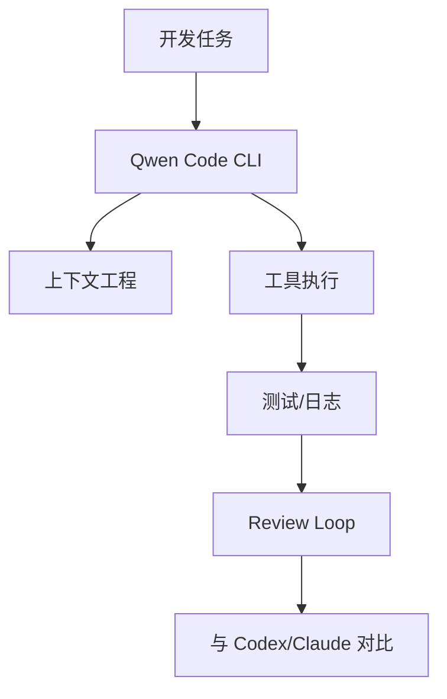

# QwenLM/qwen-code - 2026-08-30

> 一句话结论：Qwen Code 是 Loop Engineer 主题的开源 CLI coding agent 观察项。

## TL;DR
- 来源：GitHub Repository / Releases。
- 主题：coding-agent loop、CLI/TUI、权限、上下文工程。
- 原文：https://github.com/QwenLM/qwen-code

## 元信息表
| 字段 | 内容 |
|---|---|
| repo | QwenLM/qwen-code |
| 来源类型 | Repository / Release Notes |
| 工具/厂商 | Qwen / Alibaba |
| 原文 | https://github.com/QwenLM/qwen-code |

## 信息压缩图示

## 影响矩阵
| 维度 | 判断 | 说明 |
|---|---|---|
| Agent loop | 高 | CLI agent 直接相关 |
| 多 agent 编排 | 中 | 需要实测权限与日志 |
| 自托管价值 | 中 | 开源路线可观察 |

## 对我的影响
用于补全国产/开源 coding agent 对照组，关注 MCP、权限与上下文窗口。

## 可信度与局限性
direct fallback；增长不是完整全网排名。

## 相关链接
- Daily：[[Daily/2026-08-30]]
- 原文：https://github.com/QwenLM/qwen-code

#ai-radar #loop-engineering
