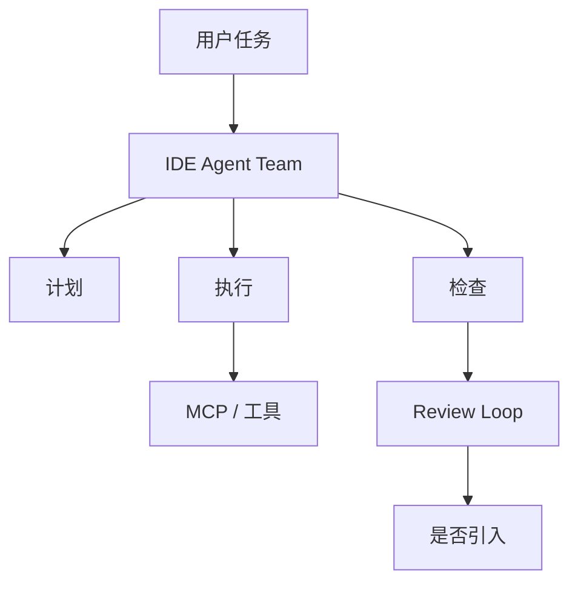

# RooCodeInc/Roo-Code - 2026-08-30

> 一句话结论：Roo Code 是 Loop Engineer 主题中值得持续观察的 IDE 多 agent coding workflow 项目。

## TL;DR
- 来源：GitHub Repository / Releases。
- 主题：IDE agent、MCP、multi-agent、权限边界。
- 原文：https://github.com/RooCodeInc/Roo-Code

## 元信息表
| 字段 | 内容 |
|---|---|
| repo | RooCodeInc/Roo-Code |
| 来源类型 | Repository / Release Notes |
| 工具/厂商 | Roo Code |
| 原文 | https://github.com/RooCodeInc/Roo-Code |

## 信息压缩图示

## 影响矩阵
| 维度 | 判断 | 说明 |
|---|---|---|
| Loop Engineering | 高 | 多 agent loop 形态 |
| AI coding workflow | 高 | IDE 内任务执行与审查 |
| 风险 | 中 | 权限、日志、回滚需实测 |

## 对我的影响
可用于对比 Claude Code/Codex 的 CLI 路线和 Cursor/Windsurf 的 IDE 路线。

## 可信度与局限性
direct fallback；增长不是完整全网日增。

## 相关链接
- Daily：[[Daily/2026-08-30]]
- 原文：https://github.com/RooCodeInc/Roo-Code

#ai-radar #loop-engineering
