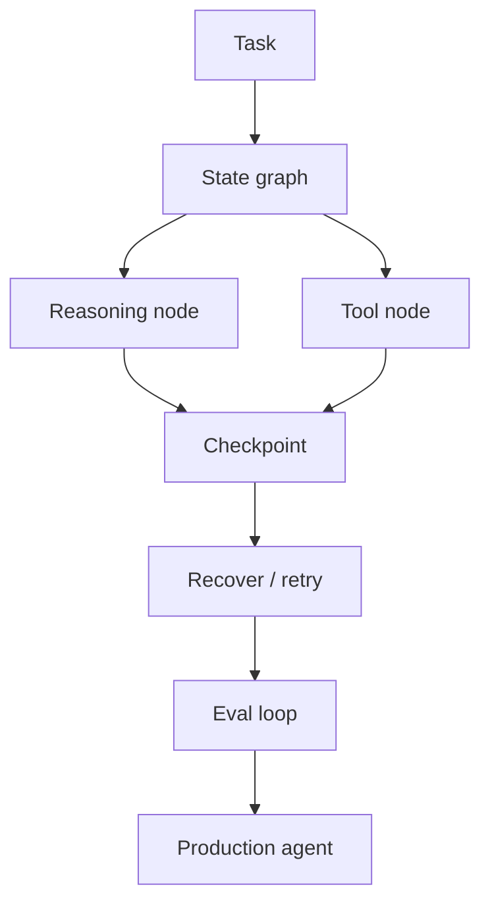

# langchain-ai/langgraph

> 日期：2026-09-04
> 来源类型：GitHub direct /repos fallback
> 原文：https://github.com/langchain-ai/langgraph

## 一句话结论
LangGraph 是图式 agent state machine 与 resilient agents 的代表项目，适合生产 agent loop、恢复和评估闭环。

## TL;DR
- 关注 state graph、checkpoint、tool calls、human feedback、eval loop。
- 对 Loop Engineer 的价值是把 agent 工作流从 prompt 链条变成可观测状态机。

## 信息压缩图示

## 专业解读
LangGraph 适合作为 coding-agent loop 和业务 agent workflow 的状态管理参考，尤其是失败恢复、检查点和评估闭环。

## 相关链接
- 日报：[[Daily/2026-09-04]]
- 原文：https://github.com/langchain-ai/langgraph

#ai-radar #loop-engineering #agent
