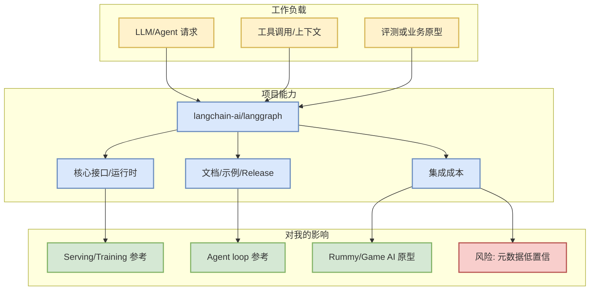

# langchain-ai/langgraph

> 一句话结论：`langchain-ai/langgraph` 是今日 LoopEngineer 观察项；当前采用 GitHub snapshot/direct fallback 元数据，适合先作为工程选型或机制拆解入口。

## TL;DR
- Stars/Forks：41208 / 6961；语言：Python。
- 更新时间：2026-09-08T00:54:01Z；增长：203（current/direct metadata vs github-stars-2026-09-04.json，非完整全网日增）。
- 重点：Build resilient agents.

## 元信息
| 字段 | 内容 |
|---|---|
| 来源 | GitHub Repository |
| repo | `langchain-ai/langgraph` |
| stars / forks | 41208 / 6961 |
| language | Python |
| topics | agents, ai, ai-agents, chatgpt, deepagents, enterprise, framework, gemini, generative-ai, langchain, langgraph, llm, multiagent, open-source, openai, pydantic, python, rag |
| updated_at | 2026-09-08T00:54:01Z |
| 原文 | https://github.com/langchain-ai/langgraph |

## 信息压缩图示

## 机制/影响矩阵
| 维度 | 判断 | 跟进动作 |
|---|---|---|
| 工程可落地性 | 高 | 先读 README / examples / releases |
| AI Infra 价值 | 与 serving、gateway、agent 或工具链相关时优先 | 对比现有 vLLM/SGLang/LiteLLM/Hermes 流程 |
| 风险 | GitHub Search 403 下部分榜单为 direct fallback | 不把增长解读为完整全网增长 |

## 专业解读
该项目今日主要用于观察生态热度、接口形态和工程趋势。若属于 serving/gateway/training，应重点看 scheduler、cache、runtime、benchmark；若属于 coding agent，应重点看上下文构建、工具权限、执行日志和 eval replay；若属于 Rummy/Game AI，应抽取 state/action/reward/evaluator。

## 通俗解释
这是一条“今天值得放进雷达”的项目卡片：先判断它解决什么问题，再决定是否值得试跑。

## 我应该如何跟进
1. 打开原文确认 README、release 和 examples。
2. 若有 benchmark，记录硬件、吞吐、延迟、成本口径。
3. 若是 agent/coding 工具，重点看权限模式、MCP、上下文窗口和回放能力。

## 相关链接
- 原文：https://github.com/langchain-ai/langgraph
- Daily：[[Daily/2026-09-08]]

#ai-radar #github #loopengineer
