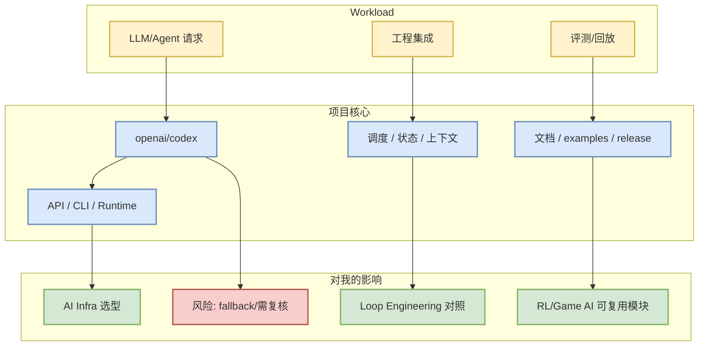

# openai/codex

> 日期：2026-09-10  
> 类型：GitHub 项目详情  
> 原文：[openai/codex](https://github.com/openai/codex)

## 一句话结论
openai/codex 是今日 AI Radar 的 fallback 观察项；对 AI Infra / agent loop / RL 工程的价值主要在于：Lightweight coding agent that runs in your terminal。

## TL;DR
- Stars / Forks：122252 / 18778
- 语言：Rust
- 更新时间：2026-09-08T01:06:26Z
- Topics：无
- 增长：987；依据：current/direct metadata vs github-stars-2026-09-04.json，非完整全网日增
- 置信说明：今日 2026-09-10 snapshot 为 Point Rummy/niche-only（repos=104, errors=39），broad/Loop 使用 2026-09-08 最近成功 broad snapshot，非今日完整全网日增。

## 元信息表
| 字段 | 内容 |
|---|---|
| repo | `openai/codex` |
| stars | 122252 |
| forks | 18778 |
| language | Rust |
| updated_at | 2026-09-08T01:06:26Z |
| pushed_at | 2026-09-08T00:15:49Z |
| topics | 无 |
| 原文 | https://github.com/openai/codex |

## 信息压缩图示

## 专业解读
- 如果这是 serving/training infra：优先看调度、KV/state、吞吐/延迟、硬件依赖、benchmark。
- 如果这是 coding-agent/loop 工具：优先看上下文构建、工具权限、执行日志、回放评测、MCP/IDE/CLI 边界。
- 如果这是 Point Rummy/Game AI 项目：优先抽象 state/action/reward/evaluator，不直接依赖低 star 代码。

## 影响矩阵
| 维度 | 判断 | 跟进动作 |
|---|---|---|
| AI Infra | 中高：取决于是否有 runtime / scheduler / benchmark | 看 README、release、examples |
| LLM Agent | 中高：可做 loop 设计对照 | 抽象 context/tool/eval loop |
| RL/Game AI | 中：只在涉及环境或搜索策略时强相关 | 抽 state/action/reward |
| 风险 | 今日 2026-09-10 snapshot 为 Point Rummy/niche-only（repos=104, errors=39），broad/Loop 使用 2026-09-08 最近成功 broad snapshot，非今日完整全网日增。 | 不把 stars_delta 当唯一依据 |

## 通俗解释
把它当成一个“候选零件”：先判断它解决的是推理、训练、agent 编排还是游戏仿真，再决定是试用、读源码还是只放观察列表。

## 我应该如何跟进
1. 打开 README 与 release notes。
2. 找 benchmark / examples / docs。
3. 若和当前工作流相关，做 30-60 分钟 spike。
4. 将可复用机制沉淀到 AI Infra 或 Loop Engineering checklist。

## 相关链接
- 原文：https://github.com/openai/codex
- Daily：[[Daily/2026-09-10]]

#ai-radar #github #ai-infra #loop-engineering
