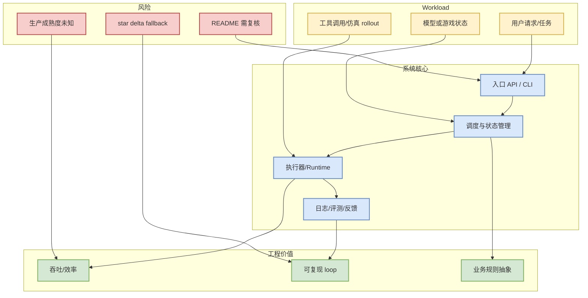
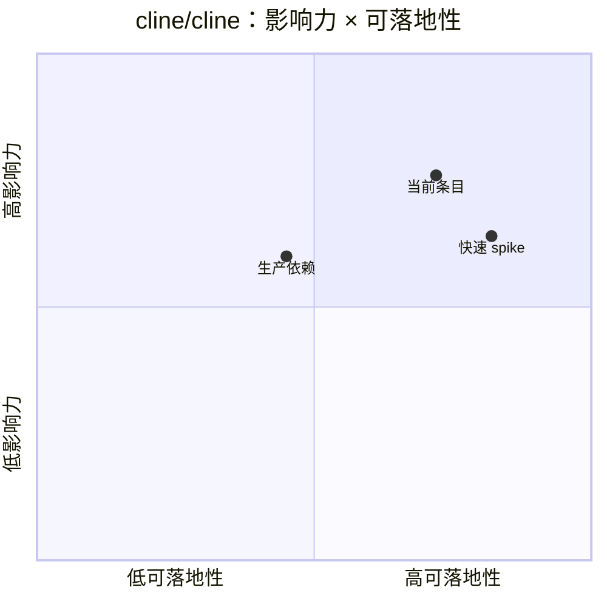

# cline/cline

> 类型：GitHub 项目详情  
> 大类：LoopEngineer  
> 小类：Loop Engineer / coding-agent loop  
> 推荐等级：可 skim  
> 创建日期：2026-09-11  
> 原文链接：https://github.com/cline/cline  
> 网页详情：https://github.com/dyt27666-oss/AI-news-report-obsidians/blob/main/GitHub/LoopEngineer/2026-09-11/cline-cline.md  
> 返回日报：[[Daily/2026-09-11]]

## 一句话结论

`cline/cline` 今天作为 **Loop Engineer / coding-agent loop** 观察项进入 Radar；由于 GitHub Search 403，若属于 broad/Loop 榜单则采用 2026-09-08 最近成功 snapshot fallback，不能解读为今日完整全网排名。

## TL;DR

- **它是什么**：Autonomous coding agent as an SDK, IDE extension, or CLI assistant.
- **为什么重要**：它落在 AI Infra / Agent loop / Game AI 的工程交叉点，可帮助判断 runtime、工具链或业务仿真的可复用程度。
- **和我相关的点**：关注 serving 调度、agent loop、工具权限、Rummy state/action/reward/evaluator 等可落地模块。
- **建议动作**：先读 README 和 release，再做 30 分钟 spike；fallback 项目不要用 star delta 做实时增长结论。

## 元信息

| 字段 | 内容 |
|---|---|
| repo | `cline/cline` |
| stars / forks | 67644 / 7302 |
| language | TypeScript |
| topics | 无 |
| updated_at | 2026-09-08T01:08:21Z |
| 来源类型 | GitHub repository / release-watch |
| 原文 | [GitHub](https://github.com/cline/cline) |
| 可信度 | fallback：非今日完整全网 |

## 信息压缩图示

### 辅助图：影响力 × 可落地性

## 专业解读

从工程角度看，`cline/cline` 的价值不在“今天是否暴涨”，而在它暴露出的系统抽象：输入如何进入 runtime，状态如何被保存，执行结果如何回流到 eval 或下一步决策。对 AI Infra 项目，要重点看 scheduler、cache、batching、control plane；对 coding-agent 项目，要重点看 context construction、tool permission、command replay、review loop；对 Rummy/Game AI 项目，要重点看规则状态、合法动作、奖励、搜索或 self-play。

## 通俗解释

可以把它当作一个可拆解的样板：不要直接搬代码，而是看它把问题拆成了哪些模块、每个模块的边界在哪里、哪些模块能被你自己的 serving/agent/Rummy 仿真系统复用。

## 关键机制拆解

| 机制 | 解决的问题 | 为什么有效 | 可能的坑 |
|---|---|---|---|
| 状态建模 | 让任务或游戏局面可被程序处理 | 后续才能做调度、搜索或评测 | 状态过粗会无法训练，过细会爆炸 |
| 执行 loop | 把输入转成行动/调用/推理 | 可插入日志、权限和重试 | 没有 replay 难以 debug |
| 评测反馈 | 判断输出是否可用 | 支撑改进和自动化 | benchmark 不匹配会误导 |

## 对我的影响

| 维度 | 影响 | 建议动作 |
|---|---|---|
| AI Infra | 可作为 runtime/control-plane 对照 | 看 README、release、benchmark |
| LLM 工程 | 观察 agent/tool loop 或模型接口 | 对比 Codex/Cline/LangGraph |
| RL / Game AI | 可抽 state/action/reward/evaluator | 做小型仿真 spike |
| Agent / Eval | 可参考执行日志与回放 | 加入 loop engineering watchlist |

## 可信度与局限性

- 证据强度：GitHub metadata + snapshot；broad/Loop 部分为 fallback。
- 局限性：未逐行审计代码，不承诺生产可用。
- 潜在风险：GitHub Search 403 导致今日全网排名不完整。
- 还需要确认：README、release notes、license、benchmark、活跃维护情况。

## 我应该如何跟进

1. 打开原 repo README，确认是否有 docs/examples/benchmark。
2. 若是 serving/agent 项，跑最小 demo；若是 Rummy 项，抽规则状态与 evaluator。
3. 记录是否值得进入长期 watchlist。

## 相关链接

- 原文：https://github.com/cline/cline
- 网页详情：https://github.com/dyt27666-oss/AI-news-report-obsidians/blob/main/GitHub/LoopEngineer/2026-09-11/cline-cline.md
- 返回日报：[[Daily/2026-09-11]]

## 标签

#ai-radar #github #loopengineer
