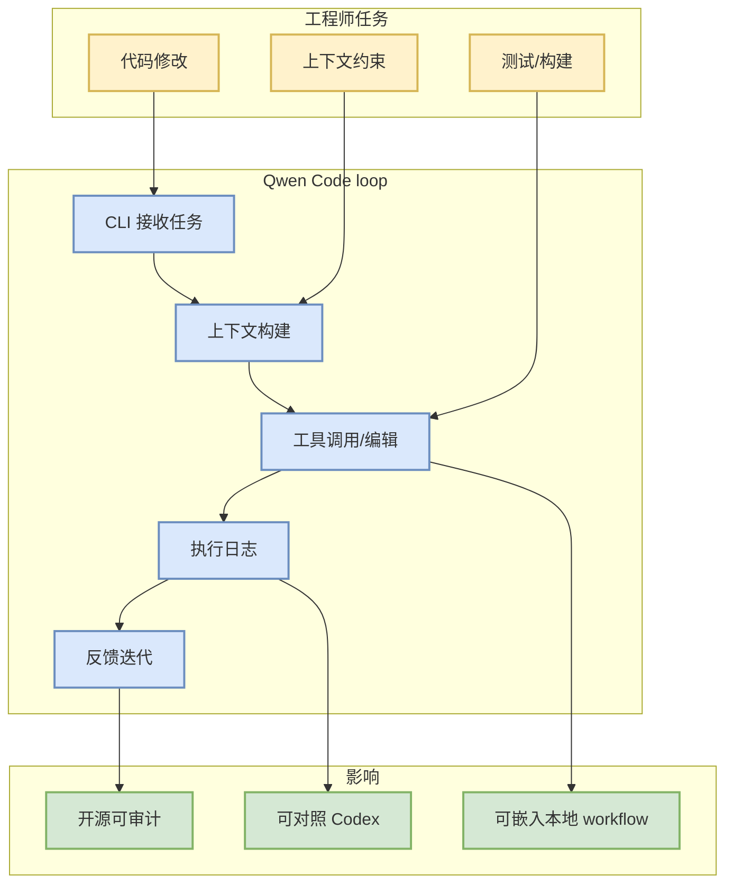
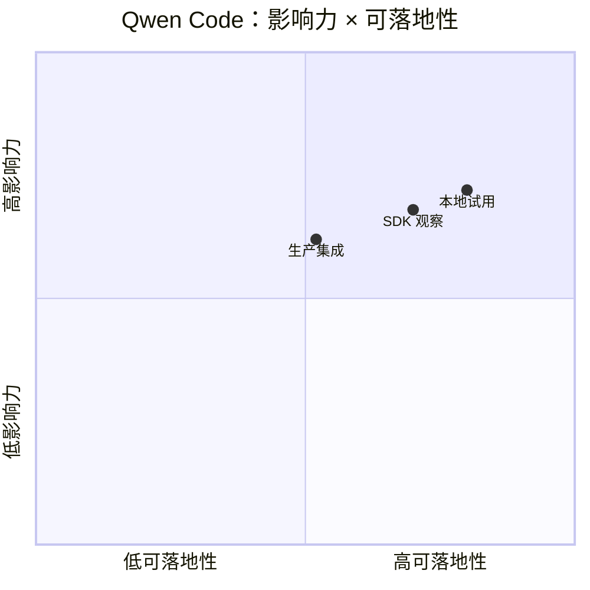

# QwenLM/qwen-code

> 类型：GitHub 项目详情  
> 大类：LoopEngineer  
> 小类：Coding agent loop / terminal agent  
> 推荐等级：可 skim  
> 创建日期：2026-09-11  
> 原文链接：https://github.com/QwenLM/qwen-code  
> 网页详情：https://github.com/dyt27666-oss/AI-news-report-obsidians/blob/main/GitHub/LoopEngineer/2026-09-11/qwenlm-qwen-code.md  
> 返回日报：[[Daily/2026-09-11]]

## 一句话结论

`QwenLM/qwen-code` 是开源 terminal coding agent，对 loop engineering、权限模式、上下文构建和多 agent workflow 有参考价值；今日使用 2026-09-08 fallback delta，非今日完整全网增长。

## TL;DR

- **它是什么**：An open-source AI coding agent that lives in your terminal.
- **为什么重要**：提供 Codex/Gemini CLI 之外的开源对照，可观察 terminal agent 如何组织上下文、工具调用和任务循环。
- **和我相关的点**：可参考其 CLI/TUI、权限边界、上下文注入和 release cadence。
- **建议动作**：阅读 latest release `sdk-typescript-v0.1.12`，确认 SDK/agent loop 变化。

## 元信息

| 字段 | 内容 |
|---|---|
| repo | `QwenLM/qwen-code` |
| 来源类型 | GitHub repository / GitHub Release |
| 原文 | [GitHub](https://github.com/QwenLM/qwen-code) |
| Release | [sdk-typescript-v0.1.12](https://github.com/QwenLM/qwen-code/releases/tag/sdk-typescript-v0.1.12) |
| 可信度 | fallback snapshot + release endpoint |

## 信息压缩图示

### 辅助图：影响力 × 可落地性

## 专业解读

Qwen Code 的价值在于提供一个可审计的 terminal agent loop：任务输入、上下文打包、工具执行、日志回放、失败重试都可以作为本地多 agent coding workflow 的设计参照。它不一定替代 Codex/Claude Code，但可以帮助判断哪些能力应该抽象成统一 harness。

## 通俗解释

它像一个开源的命令行结对程序员。真正值得看的不是它“会不会写代码”，而是它如何拿上下文、如何执行命令、如何记录过程以及如何处理失败。

## 关键机制拆解

| 机制 | 解决的问题 | 为什么有效 | 可能的坑 |
|---|---|---|---|
| CLI agent loop | 自动执行代码任务 | 可脚本化、可接入 tmux/CI | 权限边界要清晰 |
| SDK/release cadence | 嵌入其他工具 | 便于二次开发 | API 可能变化快 |
| 执行日志 | debug 和 review | 支持回放与审计 | 日志过粗则难复盘 |

## 对我的影响

| 维度 | 影响 | 建议动作 |
|---|---|---|
| AI Infra | 可用于工程自动化 | 小规模试用 |
| LLM 工程 | 观察上下文和工具调用 | 对照 Codex/Claude Code |
| RL / Game AI | 可自动化实验脚本 | 低优先 |
| Agent / Eval | loop/harness 设计参考 | 加入 watchlist |

## 可信度与局限性

- 证据强度：GitHub release + fallback snapshot。
- 局限性：未运行本地 demo，不能确认实际稳定性。
- 风险：今日增长不是实时全网增长。

## 我应该如何跟进

1. 阅读 `sdk-typescript-v0.1.12` release note。
2. 对照 Codex release，梳理 terminal agent 的共性接口。
3. 若 SDK 稳定，考虑做最小 harness spike。

## 相关链接

- 原文：https://github.com/QwenLM/qwen-code
- Release：https://github.com/QwenLM/qwen-code/releases/tag/sdk-typescript-v0.1.12
- 返回日报：[[Daily/2026-09-11]]

#ai-radar #loopengineer #coding-agent
