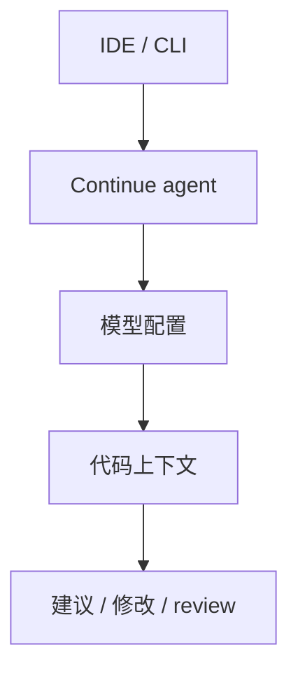
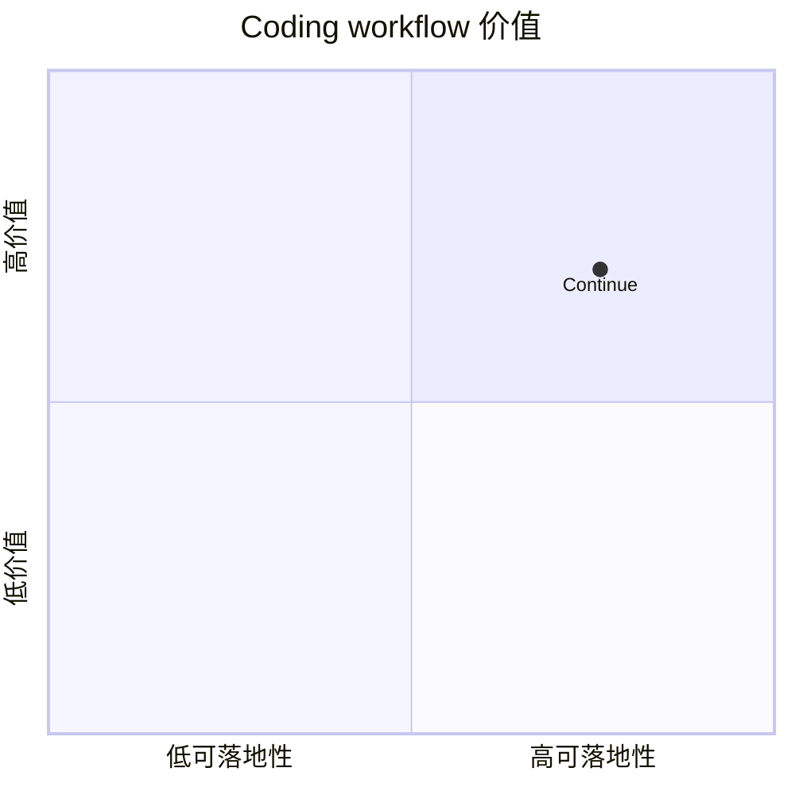

# continuedev-continue

> 类型：Loop Engineer 详情页
> 创建日期：2026-09-17
> 原文链接：https://github.com/continuedev/continue
> 返回日报：[[Daily/2026-09-17]]

## 一句话结论

Continue 是 open-source coding agent 候选，适合观察 IDE 集成、本地模型和团队可定制 workflow。

## 信息压缩图示

## 相关链接

- 原文：https://github.com/continuedev/continue
