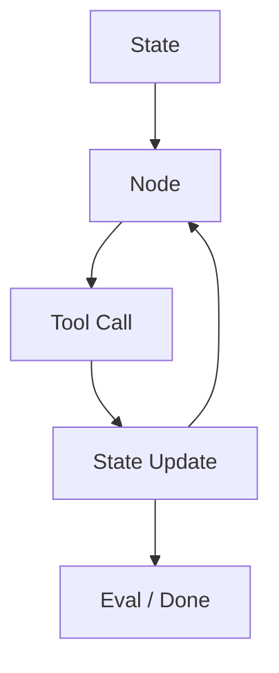
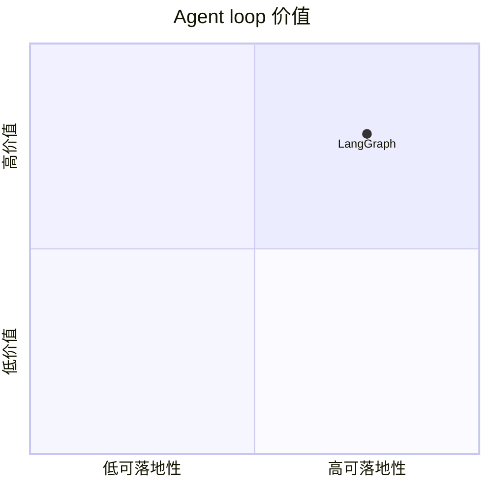

# langchain-ai-langgraph

> 类型：Loop Engineer 详情页
> 创建日期：2026-09-17
> 原文链接：https://github.com/langchain-ai/langgraph
> 返回日报：[[Daily/2026-09-17]]

## 一句话结论

LangGraph 是 agent state graph 和 loop orchestration 的重要参考，可用于 coding-agent harness 和 eval loop 设计。

## 信息压缩图示

## 相关链接

- 原文：https://github.com/langchain-ai/langgraph
