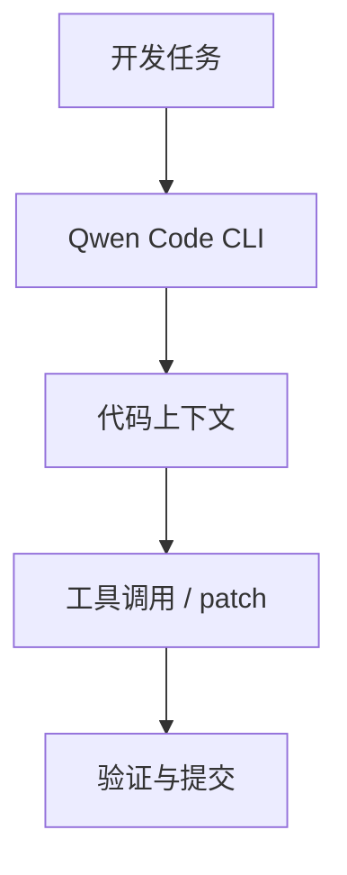
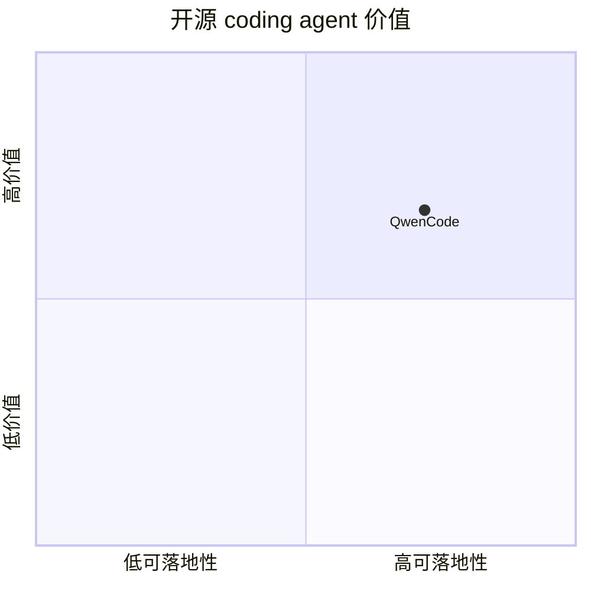

# qwenlm-qwen-code

> 类型：Loop Engineer 详情页
> 创建日期：2026-09-17
> 原文链接：https://github.com/QwenLM/qwen-code
> 返回日报：[[Daily/2026-09-17]]

## 一句话结论

Qwen Code 是 terminal AI coding agent 候选，适合观察开源模型生态里的 coding-agent loop、权限和 CLI 体验。

## 信息压缩图示

## 相关链接

- 原文：https://github.com/QwenLM/qwen-code
