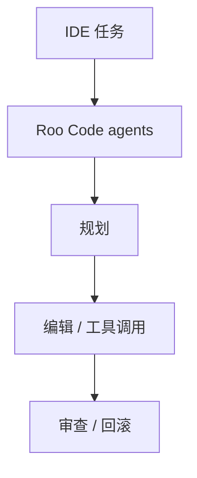
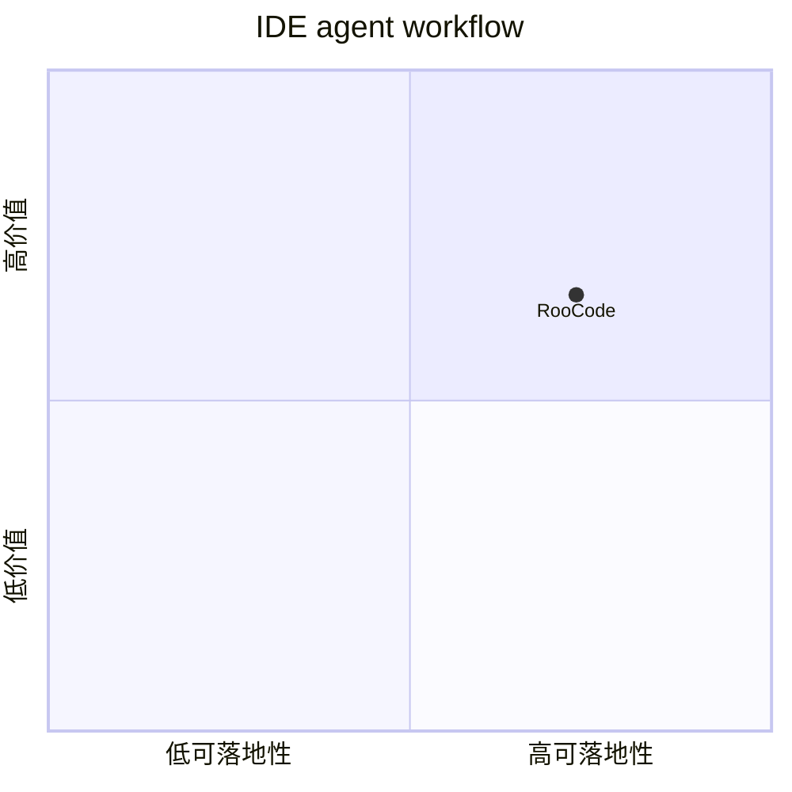

# roocodeinc-roo-code

> 类型：Loop Engineer 详情页
> 创建日期：2026-09-17
> 原文链接：https://github.com/RooCodeInc/Roo-Code
> 返回日报：[[Daily/2026-09-17]]

## 一句话结论

Roo Code 是 IDE 内多 agent coding workflow 代表项目，适合观察 agent team、权限模式和任务分解体验。

## 信息压缩图示

## 相关链接

- 原文：https://github.com/RooCodeInc/Roo-Code
