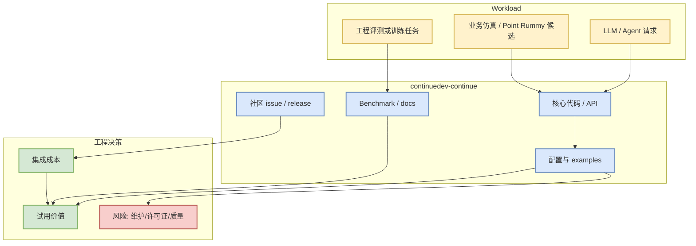
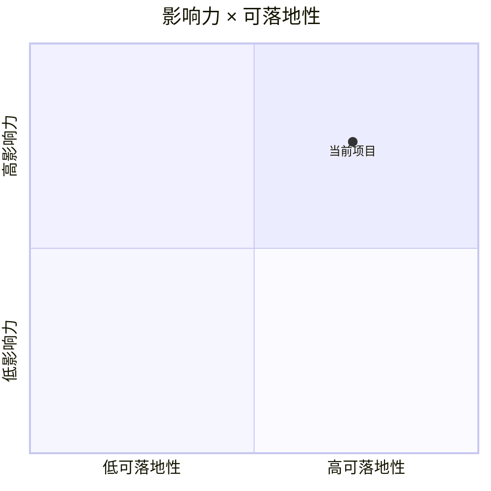

# continuedev/continue

> 类型：GitHub 项目  
> 大类：GitHub  
> 小类：Loop Engineer / Coding Agent Loop  
> 推荐等级：必读  
> 创建日期：2026-10-01  
> 原文链接：https://github.com/continuedev/continue  
> 网页详情：https://github.com/dyt27666-oss/AI-news-report-obsidians/blob/main/GitHub/LoopEngineer/2026-10-01/continuedev-continue.md  
> 返回日报：[[Daily/2026-10-01]]

## 一句话结论
continuedev/continue 是今日 Loop Engineer / Coding Agent Loop watchlist 条目；本页用于把 stars、更新状态和可试用性压缩成工程决策。

## TL;DR
- **它是什么**：open-source coding agent
- **为什么重要**：与 AI Infra、coding-agent loop、serving/training 或业务仿真相关；适合进入候选工具/基线项目列表。
- **和我相关的点**：stars=36073, forks=5447, language=TypeScript, updated_at=2026-09-30T23:32:36Z。
- **建议动作**：先读 README / examples / release，再决定是否拉分支试用；增长依据：direct watched repo fallback，非完整全网日增。

## 元信息
| 字段 | 内容 |
|---|---|
| repo | continuedev/continue |
| stars / forks | 36073 / 5447 |
| language | TypeScript |
| updated_at | 2026-09-30T23:32:36Z |
| topics | agent, ai, cli, developer-tools, open-source |
| 原文 | [GitHub](https://github.com/continuedev/continue) |

## 信息压缩图示

### 辅助图：试用优先级

## 专业解读
该项目的价值需要从三层判断：第一是它是否命中真实 workload（serving、训练、agent loop、eval 或游戏仿真）；第二是是否有可直接运行的 examples/benchmark；第三是近期更新是否说明维护活跃。当前 stars_delta=7，若标注 direct watched repo fallback，则代表它来自固定 watchlist，不应解读为全网真实日增。

## 通俗解释
把它当作“今天应该摆到桌面上看一眼的工具/项目”。不是所有条目都要马上用，但高 star、高更新频率或贴近 coding agent loop 的项目值得进入试用队列。

## 关键机制拆解
| 机制 | 解决的问题 | 为什么有效 | 可能的坑 |
|---|---|---|---|
| README/examples | 判断能否快速试跑 | 降低集成成本 | 文档可能落后于主分支 |
| stars/forks/updated_at | 判断社区和维护 | 粗略反映采用度 | star 不等于生产可用 |
| topics/description | 判断主题相关性 | 快速归类 | topic 可能缺失或泛化 |

## 对我的影响
| 维度 | 影响 | 建议动作 |
|---|---|---|
| AI Infra | 可能提供 serving/training/runtime 参考 | 对照现有栈做小样例 |
| LLM 工程 | 可影响 agent、RAG 或评测 workflow | 看是否支持 CLI/API/插件 |
| RL / Game AI | 若涉及环境或仿真，可借鉴状态/action 设计 | 不直接依赖，先抽象接口 |
| Agent / Eval | coding-agent 项目可进入多 agent 监控试验 | 记录权限、上下文、回滚能力 |

## 可信度与局限性
- 证据强度：GitHub metadata + watchlist；若 GitHub Search 403，则非完整全网扫描。
- 局限性：未做源码审计和 benchmark 复现。
- 还需要确认：license、release cadence、examples 是否可运行。

## 我应该如何跟进
1. 打开原仓库 README 与 releases。
2. 若是 serving/training 工具，跑最小 benchmark；若是 coding-agent 工具，跑小 repo 改动任务。
3. 把可复用配置沉淀到内部脚本或 Hermes skill。

## 相关链接
- 原文：https://github.com/continuedev/continue
- 网页详情：https://github.com/dyt27666-oss/AI-news-report-obsidians/blob/main/GitHub/LoopEngineer/2026-10-01/continuedev-continue.md
- 返回日报：[[Daily/2026-10-01]]

## 标签
#ai-radar #github #loopengineer
