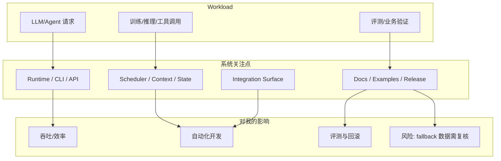

# langchain-ai/langgraph

> 类型：GitHub 项目
> 大类：GitHub
> 小类：LoopEngineer
> 推荐等级：必读
> 创建日期：2026-10-02
> 原文链接：https://github.com/langchain-ai/langgraph
> 网页详情：https://github.com/dyt27666-oss/AI-news-report-obsidians/blob/main/GitHub/LoopEngineer/2026-10-02/langchain-ai-langgraph.md
> 返回日报：[[Daily/2026-10-02]]

## 一句话结论
langchain-ai/langgraph 是今日 LoopEngineer 固定榜单条目；GitHub Search 403 背景下，本页基于 snapshot/direct watched repo fallback 保持观察连续性。

## TL;DR
- **它是什么**：Build resilient agents.
- **为什么重要**：它处在 AI Infra、LLM 工程、agent loop、coding workflow 或 Game AI 候选链路上。
- **建议动作**：打开 README/release，做小规模试用或抽取机制。

## 元信息
| 字段 | 内容 |
|---|---|
| repo | langchain-ai/langgraph |
| stars / forks | 42584 / 7221 |
| language | Python |
| updated_at | 2026-10-02T00:55:39Z |
| topics | agents, ai, ai-agents, chatgpt, deepagents, enterprise |
| stars_delta | 54 |
| 增长依据 | direct watched repo fallback，非完整全网日增 |
| 原文 | [GitHub](https://github.com/langchain-ai/langgraph) |

## 信息压缩图示

### 辅助矩阵
| 维度 | 观察点 | 下一步 |
|---|---|---|
| AI Infra | stars=42584，语言=Python | 看 benchmark / deployment docs |
| LLM 工程 | 是否能接入当前模型或 agent workflow | 做最小 demo |
| RL / Game AI | 是否提供环境、仿真或评测接口 | 仅作为抽象参考 |
| Agent / Eval | 是否改进 loop、工具调用、权限和上下文 | 加入 watchlist |

## 专业解读
当前页不宣称今日全网真实增长，而是保持固定 radar 观察点。对用户而言，重点是活跃度、接口演化、工程可落地性、权限/上下文边界和是否有 benchmark/docs/examples。

## 关键机制拆解
| 机制 | 解决的问题 | 为什么有效 | 可能的坑 |
|---|---|---|---|
| watched repo fallback | 搜索限流导致榜单缺失 | 直接 repo metadata 更稳定 | 不是完整全网排行 |
| stars_delta | 估计关注度变化 | 和历史 snapshot 对比 | 缺 baseline 时会偏差 |
| 详情页索引 | Daily 可点击导航 | 保持 Obsidian-first 知识库 | 需后续人工深读 |

## 对我的影响
| 维度 | 影响 | 建议动作 |
|---|---|---|
| AI Infra | 观察基础设施活跃度 | 每周挑 1 个项目跑 demo |
| LLM 工程 | 可能影响 serving/agent/tool 调用链路 | 关注 release/changelog |
| RL / Game AI | 部分抽象可迁移到环境/评测 | 相关时复用 |
| Agent / Eval | 可改进 coding workflow | 加入试用清单 |

## 相关链接
- 原文：https://github.com/langchain-ai/langgraph
- 网页详情：https://github.com/dyt27666-oss/AI-news-report-obsidians/blob/main/GitHub/LoopEngineer/2026-10-02/langchain-ai-langgraph.md

## 标签
#ai-radar #github #loopengineer
