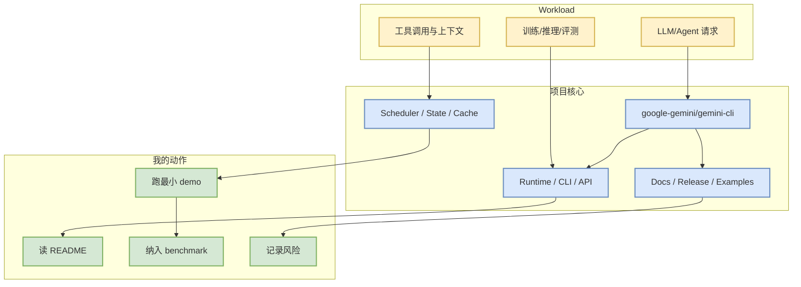

# google-gemini/gemini-cli

> 一句话结论：An open-source AI agent that brings the power of Gemini directly into your terminal.

## TL;DR
- 来源：GitHub snapshot / direct `/repos` fallback。
- Stars/Forks：107214 / 14684；语言：TypeScript。
- 更新时间：2026-10-03T00:50:35Z；原文：https://github.com/google-gemini/gemini-cli。
- 增长依据：direct watched repo fallback，非完整全网日增。

## 元信息表
| 字段 | 值 |
|---|---|
| repo | google-gemini/gemini-cli |
| stars | 107214 |
| forks | 14684 |
| language | TypeScript |
| topics | ai, ai-agents, cli, gemini, gemini-api, mcp-client, mcp-server |
| updated_at | 2026-10-03T00:50:35Z |
| source | direct /repos fallback |
| 原文 | https://github.com/google-gemini/gemini-cli |

## 信息压缩图示

## 机制 / 影响矩阵
| 维度 | 观察点 | 对我的影响 |
|---|---|---|
| 工程成熟度 | star、fork、更新频率、release | 判断是否进入试用队列 |
| AI Infra 相关性 | serving / training / agent / eval | 映射到现有 LLM Infra 或 coding-agent 工作流 |
| 风险 | API 变化、文档质量、维护节奏 | 先跑 examples/benchmark，不直接生产依赖 |

## 专业解读
该项目今日作为 AI Radar 候选进入榜单。若它属于基础设施类，重点看 scheduler、KV/cache、分布式、吞吐/延迟和硬件依赖；若属于 coding-agent 类，重点看权限模式、上下文管理、tool use、MCP、eval loop 和 IDE/CLI 集成。

## 通俗解释
把它当作一个“是否值得拿来做实验”的候选：先看活跃度和文档，再决定是否接入自己的小 benchmark。

## 可信度与局限性
- 今日 GitHub Search 被 Rummy 主题部分消耗后出现 403，broad/Loop 榜单使用 watched direct fallback，不代表完整全网排名。
- 未自动阅读全文 README；结论偏工程雷达。

## 我应该如何跟进
1. 打开原 repo 阅读 README/Release。
2. 若与 serving/training/agent loop 强相关，跑最小 demo。
3. 对比现有栈记录延迟、吞吐、上下文窗口、权限与评测能力。

#ai-radar #github #loopengineer
