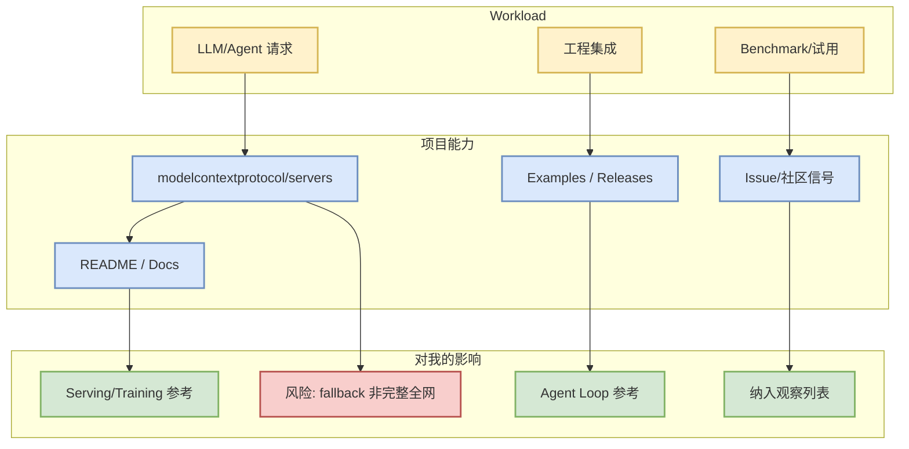

# modelcontextprotocol/servers

> 一句话结论：这是今日 AI Radar 的 LoopEngineer 观察项目；当前榜单依据为 `direct watched repo fallback，非完整全网日增`。

## TL;DR
- Stars / forks：90986 / 11753
- 语言：TypeScript
- 最近更新：2026-10-04T00:07:11Z
- 主题：无/未获取
- 原文：https://github.com/modelcontextprotocol/servers

## 元信息
| 字段 | 值 |
|---|---|
| repo | `modelcontextprotocol/servers` |
| source type | GitHub Repository |
| stars_delta | 26 |
| growth_basis | direct watched repo fallback，非完整全网日增 |
| description | Model Context Protocol Servers |

## 信息压缩图示

## 专业解读
Model Context Protocol Servers。对 AI Infra / Loop Engineering 的价值在于：它提供了可观察的工程接口、生态位置和活跃度信号，可用于决定是否试用、复现 benchmark 或纳入内部工具链对比。

## 机制/影响矩阵
| 维度 | 判断 |
|---|---|
| 生产可用性 | 需要结合 release、docs、issue 再验证 |
| AI Infra 价值 | serving/training/runtime 相关项目优先 benchmark |
| Agent 工作流价值 | CLI/TUI、MCP、权限、上下文工程相关项目优先试用 |
| 局限性 | 今日 GitHub Search 被 403，fallback 榜单不是完整全网排名 |

## 我应该如何跟进
1. 打开 README 和 release notes。
2. 若属于 serving/training，跑最小 benchmark。
3. 若属于 coding agent，检查权限模式、MCP、上下文窗口和远程执行边界。

## 相关链接
- 原文：https://github.com/modelcontextprotocol/servers
- GitHub Daily：[[Daily/2026-10-04]]

#AI-Radar #GitHub #LoopEngineer
