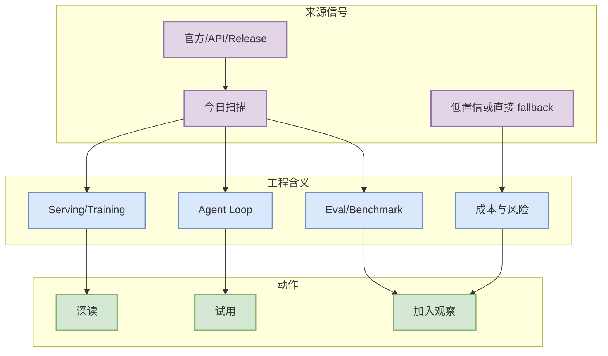

# crewAIInc/crewAI

> 类型：GitHub Repo
> 大类：GitHub
> 小类：AI Infra / Agent / Tooling
> 推荐等级：必读
> 创建日期：2026-10-06
> 原文链接：https://github.com/crewAIInc/crewAI
> 网页详情：https://github.com/dyt27666-oss/AI-news-report-obsidians/blob/main/GitHub/LoopEngineer/2026-10-06/crewaiinc-crewai.md
> 返回日报：[[Daily/2026-10-06]]

## 一句话结论

crewAIInc/crewAI：Framework for orchestrating role-playing, autonomous AI agents. By fostering collaborative intelligence, CrewAI empowers agents to work together seamlessly, tackling complex tasks.

## TL;DR

- **它是什么**：crewAIInc/crewAI 的今日 Radar 详情页，来自直接 API / 官方页面 / 低置信扫描。
- **为什么重要**：stars=59376，适合作为 watched fallback 观察 AI Infra/Agent/RL 生态变化。
- **和我相关的点**：影响 LLM serving、训练效率、agent coding loop 或 RL/Game AI 工程决策。
- **建议动作**：先看元信息和架构图，再决定是否试用或加入观察列表。

## 元信息

| 字段 | 内容 |
|---|---|
| 发布方/来源 | GitHub Repo |
| 栏目/来源类型 | Radar detail |
| 发布时间 | 2026-10-06 |
| 原文 | [原文](https://github.com/crewAIInc/crewAI) |
| 标签 | #ai-radar #detail |

## 信息压缩图示

### 辅助结构：影响矩阵

| 维度 | 影响 | 建议动作 |
|---|---|---|
| AI Infra | stars=59376，适合作为 watched fallback 观察 AI Infra/Agent/RL 生态变化。 | 检查是否影响 serving/training roadmap |
| LLM 工程 | 关注上下文、吞吐、工具链集成 | 加入试用清单 |
| RL / Game AI | 可借鉴评测、仿真、agent loop | 观察是否能复用于 rummy env/evaluator |
| Agent / Eval | 关注工具调用、权限、harness、失败恢复 | 建立小型 benchmark |

## 专业解读

crewAIInc/crewAI：Framework for orchestrating role-playing, autonomous AI agents. By fostering collaborative intelligence, CrewAI empowers agents to work together seamlessly, tackling complex tasks. 这类信号的价值不在标题本身，而在它是否改变工程约束：吞吐、延迟、上下文、权限、调度、数据闭环或评估闭环。对 AI Infra 工程师而言，优先检查其 benchmark、部署边界和集成成本；对 RL/Game AI，则关注能否变成可重复的环境、rollout 或 evaluator。

## 通俗解释

可以把它看成今天 Radar 雷达上的一个坐标点：如果它降低了试错成本或暴露了新方向，就值得进入“深读/试用”；如果来源低置信，则先保留为观察项。

## 关键机制拆解

| 机制 | 解决的问题 | 为什么有效 | 可能的坑 |
|---|---|---|---|
| 来源扫描 | 避免漏掉固定来源 | 每日矩阵强制覆盖 | 官方页可能访问失败 |
| direct fallback | Search rate limit 下保留连续性 | 使用 watched repo/API 元数据 | 非完整全网排名 |
| 详情页索引 | 将日报变成导航页 | 便于 Obsidian 深读 | 需验证 wikilink |

## 可信度与局限性

- 证据强度：中等；GitHub direct API 较可靠，网页扫描可能低置信。
- 局限性：GitHub Search 今日 403，增长榜是 watched repo fallback，非完整全网日增。
- 还需要确认：官方 changelog/blog 是否有隐藏分页或动态渲染内容。

## 我应该如何跟进

1. 打开原文确认功能/论文细节。
2. 如果是工具或 repo，拉取 README/release 并做 30 分钟 smoke test。
3. 将能复用到 serving、agent loop 或 Rummy evaluator 的部分加入 backlog。

## 相关链接

- 原文：https://github.com/crewAIInc/crewAI
- 网页详情：https://github.com/dyt27666-oss/AI-news-report-obsidians/blob/main/GitHub/LoopEngineer/2026-10-06/crewaiinc-crewai.md

## 标签

#ai-radar #detail
