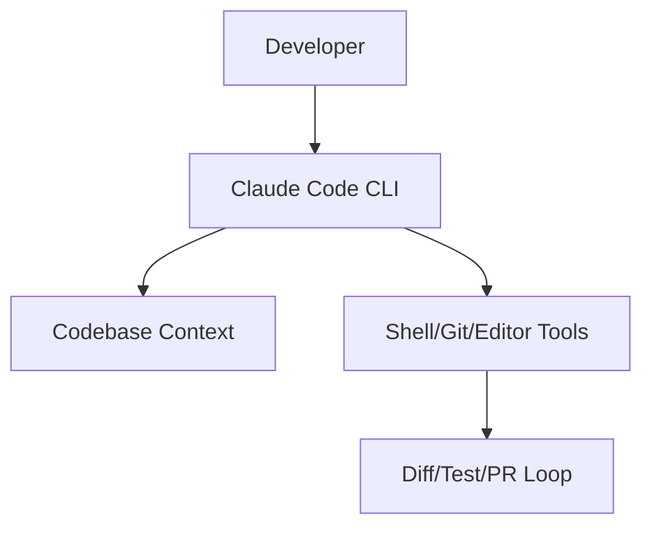

# anthropics/claude-code

> 来源类型：GitHub / Coding Agent fallback
> 原文：https://github.com/anthropics/claude-code

## 一句话结论
Claude Code 代表终端 agentic coding、权限控制、repo 理解和 git workflow 自动化方向。

## 对我的影响
适合继续跟踪 tmux 多 agent、代码审查、权限模式和 MCP/IDE 集成。

#ai-radar #coding-agent #loop-engineer
