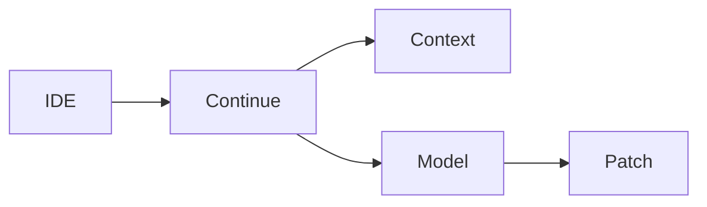

# continuedev/continue

> 来源类型：GitHub / Coding Agent fallback
> 原文：https://github.com/continuedev/continue

## 一句话结论
Continue 是开源 IDE/CLI coding agent 工作流观察项。

```mermaid
flowchart LR
  IDE --> Continue
  Continue --> Context
  Continue --> Model
  Model --> Patch
```

#ai-radar #continue
