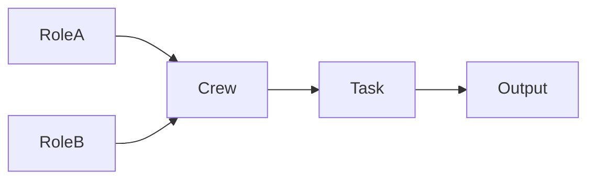

# crewAIInc/crewAI

> 来源类型：GitHub / Agent framework fallback
> 原文：https://github.com/crewAIInc/crewAI

## 一句话结论
CrewAI 用于观察 role-playing multi-agent orchestration。

```mermaid
flowchart LR
  RoleA --> Crew
  RoleB --> Crew
  Crew --> Task
  Task --> Output
```

#ai-radar #agents
