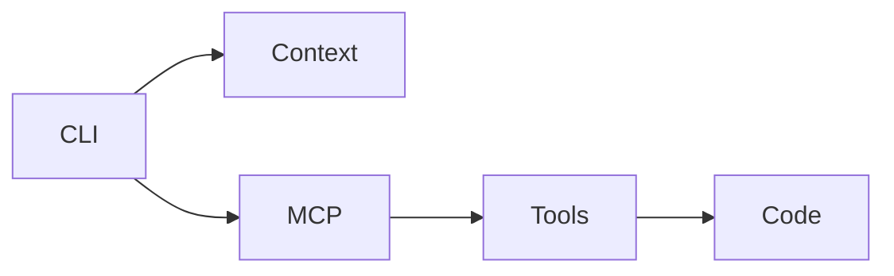

# google-gemini/gemini-cli

> 来源类型：GitHub / Coding Agent fallback
> 原文：https://github.com/google-gemini/gemini-cli

## 一句话结论
Gemini CLI 是开源终端 agent 与 MCP 能力观察项。

```mermaid
flowchart LR
  CLI --> Context
  CLI --> MCP
  MCP --> Tools
  Tools --> Code
```

#ai-radar #gemini #coding-agent
