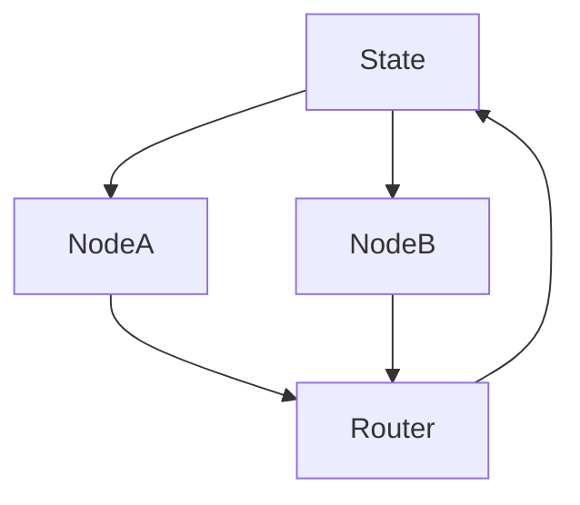

# langchain-ai/langgraph

> 来源类型：GitHub / Agent framework fallback
> 原文：https://github.com/langchain-ai/langgraph

## 一句话结论
LangGraph 是构建 resilient agent state machine 的核心框架。

#ai-radar #langgraph #agents
