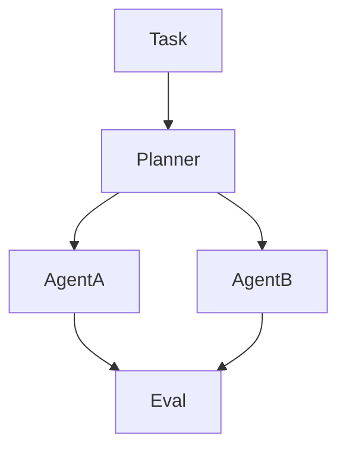

# microsoft/autogen

> 来源类型：GitHub / Agent framework fallback
> 原文：https://github.com/microsoft/autogen

## 一句话结论
AutoGen 是 multi-agent programming framework 的长期观察项目。

#ai-radar #agents #loop-engineer
