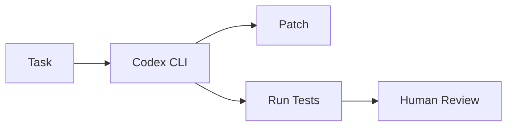

# openai/codex

> 来源类型：GitHub / Coding Agent fallback
> 原文：https://github.com/openai/codex

## 一句话结论
Codex 是终端 coding agent 与远程/本地执行工作流的关键观察对象。

## 对我的影响
影响 AI coding worker、自动修复、PR 生成和沙箱执行的工作流设计。

#ai-radar #codex #loop-engineer
