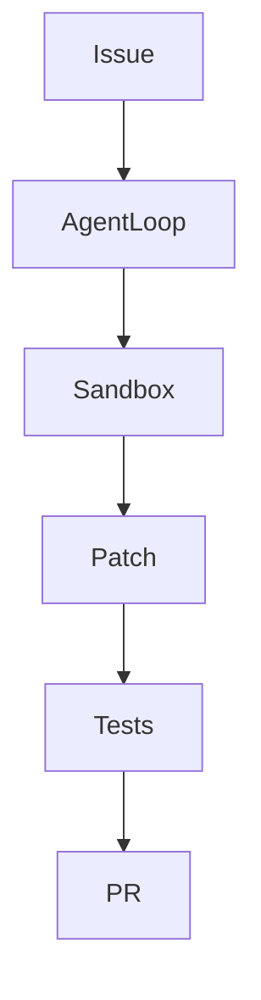

# OpenHands/OpenHands

> 来源类型：GitHub / Coding Agent fallback
> 原文：https://github.com/OpenHands/OpenHands

## 一句话结论
OpenHands 代表完整 AI-driven development harness，可用于观察 agent loop、sandbox、task execution。

#ai-radar #openhands #loop-engineer
