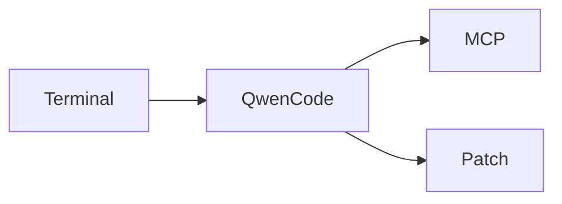

# QwenLM/qwen-code

> 来源类型：GitHub / Coding Agent fallback
> 原文：https://github.com/QwenLM/qwen-code

## 一句话结论
Qwen Code 是开源终端 coding agent 与 Qwen 模型生态结合的观察项。

```mermaid
flowchart LR
  Terminal --> QwenCode
  QwenCode --> MCP
  QwenCode --> Patch
```

#ai-radar #qwen #coding-agent
