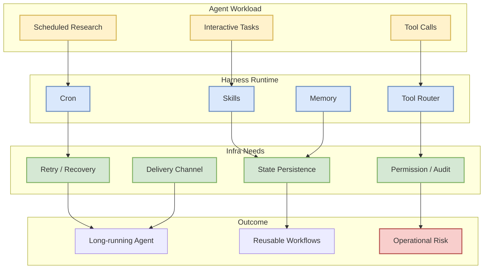
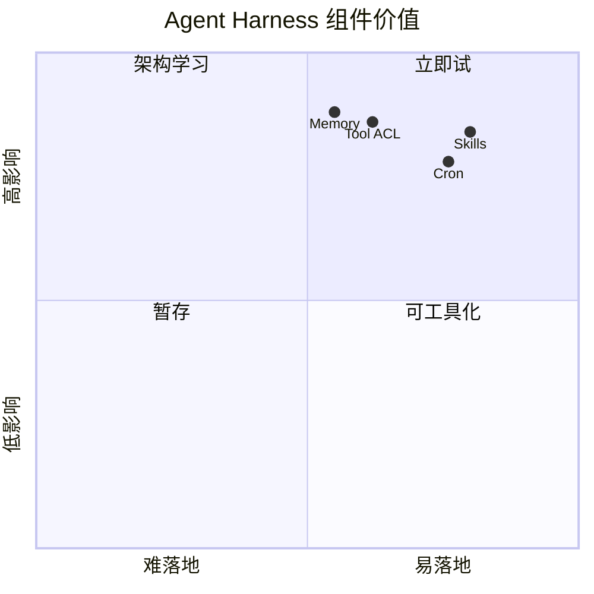

# NousResearch/hermes-agent

> 类型：GitHub 项目  
> 大类：GitHub  
> 小类：Agent Harness  
> 推荐等级：后续深挖  
> 创建日期：2026-06-11  
> 原文链接：https://github.com/NousResearch/hermes-agent  
> 返回日报：[[Daily/2026-06-11]]

## 一句话结论

Hermes Agent 代表 agent harness 正在从“聊天壳”走向 skills、memory、cron、工具、长任务和多端同步的一体化运行时。

## TL;DR

- **它是什么**：面向长期任务和工具化工作流的 agent harness。
- **为什么重要**：Agent 系统的瓶颈已经从单次推理转向上下文、工具、状态、权限和任务调度。
- **和我相关的点**：可作为 agent runtime / memory / skill / cron 架构观察对象。
- **建议动作**：对比内部 agent 平台，重点看状态管理、工具权限和任务恢复。

## 元信息

| 字段 | 内容 |
|---|---|
| repo | NousResearch/hermes-agent |
| 来源类型 | GitHub Repository |
| stars | 188833（来自 2026-06-10 fallback snapshot） |
| forks | 32573 |
| language | Python |
| 原文 | [GitHub](https://github.com/NousResearch/hermes-agent) |

## 信息压缩图示

## 专业解读

Agent harness 的核心价值是把一次性 LLM call 包装成可长期运行的系统：任务调度、工具权限、状态恢复、技能复用和多端交互都会成为工程对象。Hermes Agent 的增长说明社区对“可运营 agent”的需求很强。

## 通俗解释

它不是单纯聊天机器人，而像一个能定时工作、记住流程、调用工具并生成报告的个人自动化系统。

## 关键机制拆解

| 机制 | 解决的问题 | 为什么有效 | 可能的坑 |
|---|---|---|---|
| Skills | 复用任务流程 | 降低重复提示成本 | 技能陈旧会误导 |
| Cron | 自动执行周期任务 | 适合 radar / monitor | 失败恢复复杂 |
| Memory | 长期个性化 | 改善上下文连续性 | 需要安全和纠错 |

## 对我的影响

| 维度 | 影响 | 建议动作 |
|---|---|---|
| AI Infra | agent runtime 需要可靠性和观测 | 对比任务恢复设计 |
| LLM 工程 | prompt / skill 可产品化 | 观察技能管理 |
| RL / Game AI | 可借鉴 long-horizon task loop | 关注状态和反馈 |
| Agent / Eval | 直接高相关 | 建立 harness eval |

## 可信度与局限性

- 证据强度：中；GitHub 元数据来自 fallback snapshot。
- 局限性：今日 API 限流，未刷新实时 stars。
- 还需要确认：README、release、issue 活跃度和架构细节。

## 我应该如何跟进

1. 阅读 README 和架构文档。
2. 对比内部 agent runtime 的 skills/memory/cron 设计。
3. 选一个低风险自动化任务做最小试用。

## 相关链接

- GitHub：https://github.com/NousResearch/hermes-agent
- 返回日报：[[Daily/2026-06-11]]

## 标签

#ai-radar #github #agent #ai-infra
