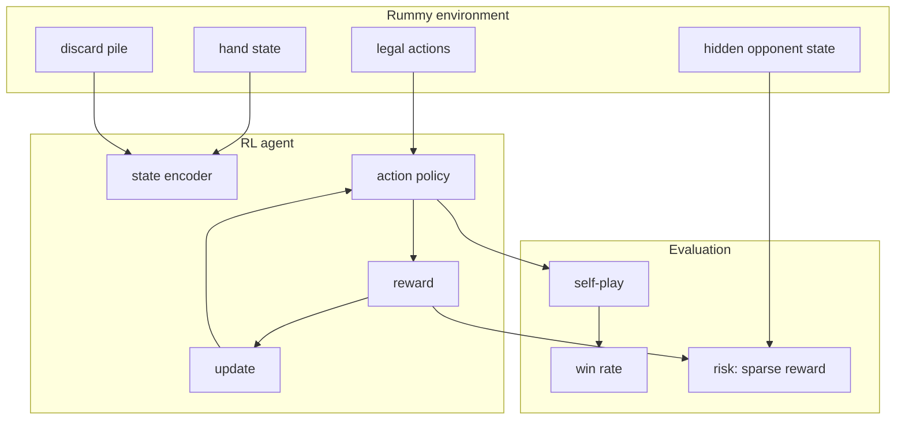
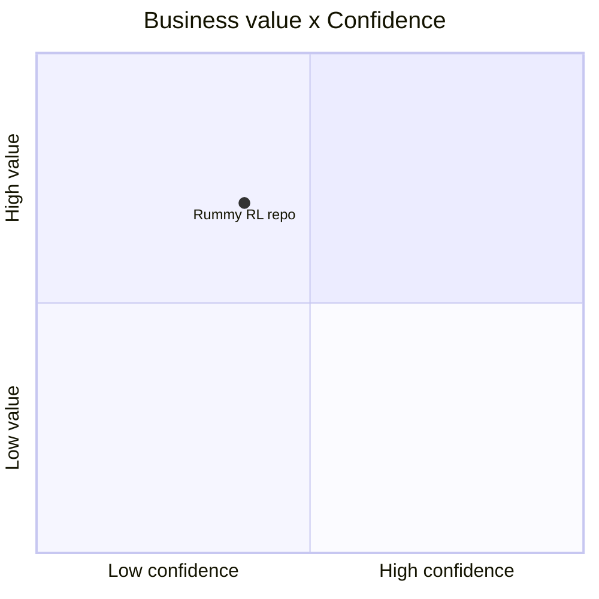

# Abhilash-Mandlekar/RummyAgent-Reinforecement-Learning

> Type: GitHub detail
> Date: 2026-07-13
> Source: https://github.com/Abhilash-Mandlekar/RummyAgent-Reinforecement-Learning
> Return: [[Daily/2026-07-13]]

## One-line Takeaway

This is a low-star but highly topical Rummy RL reference for environment and reward-shaping ideas.

## TL;DR

- What it is: a Rummy agent trained with reinforcement learning.
- Why it matters: useful for thinking about imperfect-information card-game states.
- Action: inspect notebooks for state/action/reward definitions.

## Metadata

| Field | Value |
|---|---|
| Source | GitHub |
| Source type | Point Rummy RL topic repo |
| Original | [repo](https://github.com/Abhilash-Mandlekar/RummyAgent-Reinforecement-Learning) |
| Daily | [[Daily/2026-07-13]] |

## Diagram

## Professional Notes

Treat this as a concept source. The misspelled repo name and old notebook style require careful review before reuse.

## Follow-up

1. Extract state/action/reward definitions.
2. Compare with RLCard-style environment APIs.
3. Build a cleaner internal simulator if useful.

#ai-radar #point-rummy #reinforcement-learning
