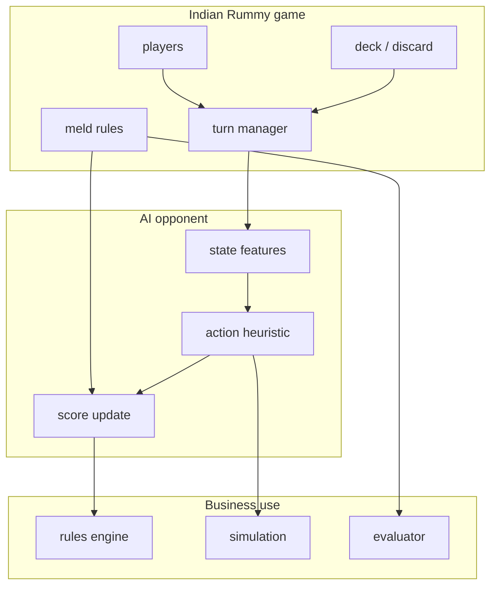
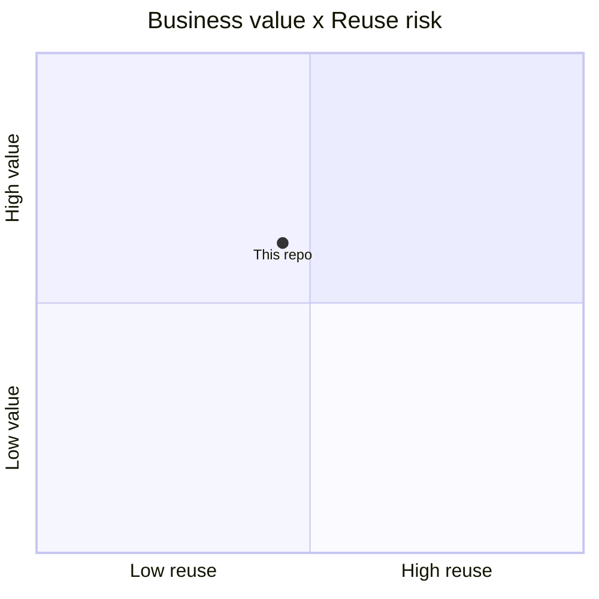

# abubakarmunir712/dsa-final-project

> Type: GitHub detail
> Date: 2026-07-13
> Source: https://github.com/abubakarmunir712/dsa-final-project
> Return: [[Daily/2026-07-13]]

## One-line Takeaway

This small Indian Rummy project is useful as a rules-and-AI-opponent reference, not as production code.

## TL;DR

- What it is: Python multiplayer Indian Rummy with AI opponents and LAN play.
- Why it matters: can inform state modeling, turn flow, and bot scaffolding.
- Action: extract rules/evaluator ideas only after code review.

## Metadata

| Field | Value |
|---|---|
| Source | GitHub |
| Source type | Point Rummy topic repo |
| Original | [repo](https://github.com/abubakarmunir712/dsa-final-project) |
| Daily | [[Daily/2026-07-13]] |

## Diagram

## Professional Notes

Small repo quality is uncertain, but the described AI opponent and game structures are relevant for Point Rummy environment design.

## Follow-up

1. Inspect rule completeness.
2. Extract observation/action/reward schema.
3. Do not reuse code before license and quality review.

#ai-radar #point-rummy #game-ai
