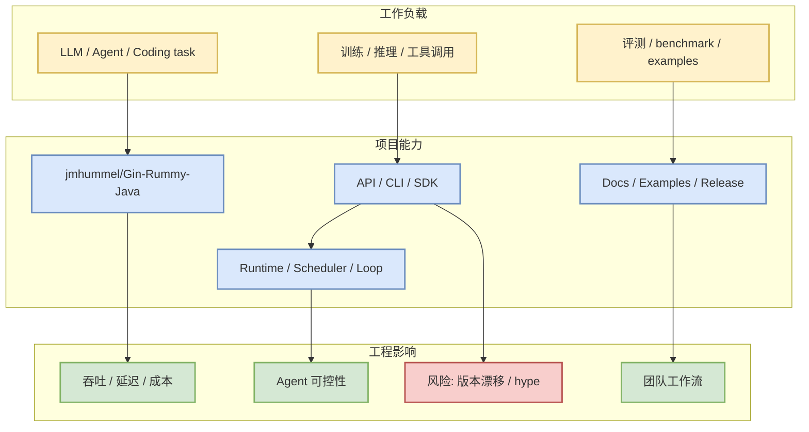

# jmhummel/Gin-Rummy-Java

> 日期：2026-07-16
> 类型：GitHub / AI Radar 详情
> 原文：https://github.com/jmhummel/Gin-Rummy-Java

## 一句话结论

Java-based Gin Rummy console game, with an AI opponent

## TL;DR

- stars / forks：8 / 0。
- 语言：Java；最近更新：2023-08-16T16:12:58Z。
- 今日信号：direct `GET /repos` watched fallback；如果有 `stars_delta`，它只代表 watched baseline，不是完整全网日增。
- 对用户价值：用于 AI Infra、LLM serving/training、agent loop 或 coding workflow 的工程判断。

## 元信息

| 字段 | 内容 |
|---|---|
| repo | `jmhummel/Gin-Rummy-Java` |
| stars | 8 |
| forks | 0 |
| language | Java |
| updated_at | 2023-08-16T16:12:58Z |
| topics | ai, artificial-intelligence, card-game, card-games, cardgame, gin, gin-rummy, java, java-8, java8, rummy |
| 原文 | https://github.com/jmhummel/Gin-Rummy-Java |

## 信息压缩图示

## 优先级矩阵

| 维度 | 判断 | 理由 |
|---|---|---|
| 相关性 | 高 | 与 AI Infra / LLM / Agent / Coding workflow 至少一个核心主题相关。 |
| 可落地性 | 中到高 | 可通过 docs、examples、release 或源码抽取工程实践。 |
| 风险 | 中 | 今日 GitHub Search 被限流，direct fallback 不是全网榜单。 |
| 下一步 | skim / 局部试用 | 先看 release、examples、issues，再决定是否引入实验。 |

## 专业解读

Java-based Gin Rummy console game, with an AI opponent 对用户的价值不在“star 数本身”，而在它暴露的工程接口、调度/执行模式、工具边界和社区采用速度。今天的采集因 GitHub Search 403，采用 watched repo direct fallback；这能保证核心项目不断档，但不能代表完整趋势排名。

## 通俗解释

可以把它看成今天 radar 里的一个固定观测点：即使搜索 API 失效，也要知道这些基础项目是否继续活跃，因为它们会影响后续模型训练、推理服务或 AI 编码工作流的默认选型。

## 关键机制拆解

| 模块 | 关注点 | 跟进方式 |
|---|---|---|
| 接口 | CLI / SDK / API / server | 看 README、examples 和 release notes |
| Runtime | scheduler / tool loop / GPU runtime | 看近期 commits、issues、benchmark |
| 生态 | plugins / MCP / integrations | 看 topics、社区 examples |
| 风险 | breaking changes / rate limits | 看 changelog 和 open issues |

## 对我的影响

- AI Infra：判断是否影响 serving、training、GPU runtime 或 eval pipeline。
- LLM/Agent：判断是否影响 tool-use、memory、context、multi-agent orchestration。
- Coding workflow：判断是否值得纳入 tmux 多 agent、代码审查或自动化修复流程。

## 可信度与局限性

- 可信度：repo 元数据来自 GitHub direct API 或当日 snapshot。
- 局限性：今日 broad GitHub Search 403，增长榜不是完整全网增长。

## 我应该如何跟进

1. skim README / release notes。
2. 看最近 3-5 个 issues/PR 是否涉及 breaking change。
3. 对 serving/coding agent 类项目，优先跑最小 demo。

## 相关链接

- 原文：https://github.com/jmhummel/Gin-Rummy-Java
- 日报：[[Daily/2026-07-16]]

#ai-radar #github #ai-infra #agent #llm
