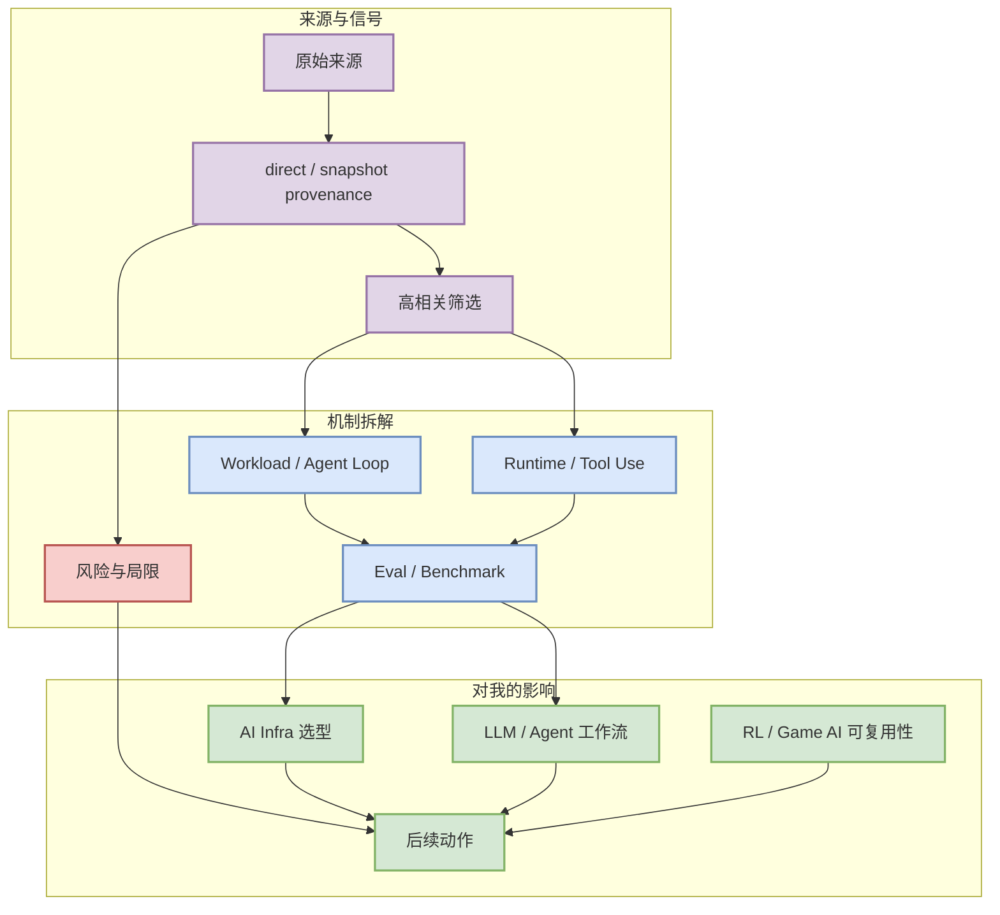

# nakkekakke/rummy-ai

> 生成日期：2026-07-19
> 来源类型：GitHub Search / Point Rummy topic
> 原文：https://github.com/nakkekakke/rummy-ai

## 一句话结论
Text based classic Rummy game with an AI that uses ISMCTS. Data Structures and Algorithms course project, University of Helsinki

## TL;DR
- Text based classic Rummy game with an AI that uses ISMCTS. Data Structures and Algorithms course project, University of Helsinki
- 它可用于拆解 Indian/Point Rummy 的规则状态机、AI opponent、ISMCTS/RL bot 或 evaluator 设计。
- 今日上下文：GitHub Search 在主题查询后出现 403，因此 broad/Loop/工具榜单以 direct watched repo fallback 或最新 snapshot 标注 provenance。

## 元信息表

| 字段 | 值 |
|---|---|
| 类型 | Point Rummy |
| 日期 | 2026-07-19 |
| 来源类型 | GitHub Search / Point Rummy topic |
| 原文链接 | https://github.com/nakkekakke/rummy-ai |

## 信息压缩图示

## 影响矩阵

| 维度 | 判断 | 说明 |
|---|---|---|
| AI Infra | 中高 | 是否影响 serving、runtime、训练框架、工具接入或 eval harness。 |
| LLM / Agent | 高 | 若涉及 CLI/TUI、MCP、权限、上下文和 agent loop，则优先级提升。 |
| RL / Game AI | 中 | 仅当能复用为环境、rollout、reward 或 evaluator 时提升。 |
| 可信度 | 中 | 本页保留来源链接和 fallback 标注；release 细节需后续人工深读。 |

## 专业解读
它可用于拆解 Indian/Point Rummy 的规则状态机、AI opponent、ISMCTS/RL bot 或 evaluator 设计。 对用户而言，关键不是表层热度，而是它能否沉淀成可复用的工程组件：调度、缓存、rollout、tool-use、权限模型、benchmark 或 agent loop 观测。

## 通俗解释
可以把它看成今天信息流里的一个高信号节点：它不一定要求马上引入生产，但值得放到 watchlist，并决定是否做小实验。

## 关键机制拆解
- 输入：来自 GitHub / 论文 / 工具 changelog / 公司博客的公开信号。
- 过滤：只保留 AI Infra、LLM、RL、Agent、Eval、Serving、Training、Post-training、World Model、AI coding workflow 强相关内容。
- 输出：进入日报索引，并按主题链接到后续可执行动作。

## 对我的影响
- AI Infra：观察是否能降低 serving/training/eval 的复杂度或成本。
- Coding workflow：观察是否改变多 agent 开发、代码审查、权限控制和上下文管理。
- Point Rummy / RL：若涉及游戏环境或不完全信息策略，优先抽象成 gym-like interface。

## 可信度与局限性
- 可信度：中。直接来源可点击，但 GitHub Search 今日部分 403，榜单明确使用 fallback。
- 局限性：未把 fallback 增长表述为完整全网日增；部分官网 changelog 仅做入口扫描。

## 我应该如何跟进
1. 如果与当前工程栈直接相关，做 30-60 分钟 spike。
2. 如果只是生态信号，加入 watchlist，等待 release notes 或 benchmark。
3. 对工具类项目，重点复核权限模型、上下文窗口、MCP/IDE 集成和 remote execution。

## 相关链接
- 原文：https://github.com/nakkekakke/rummy-ai
- 日报：[[Daily/2026-07-19]]

## 标签
#ai-radar #point-rummy #watchlist
