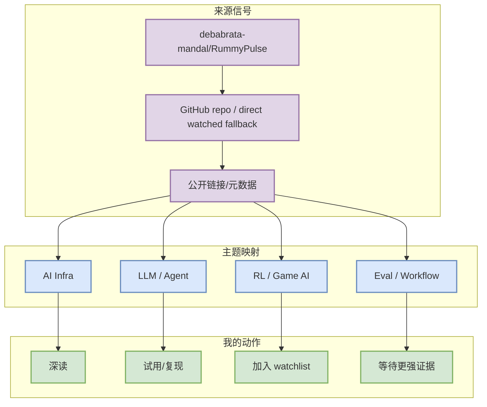

# debabrata-mandal/RummyPulse

> 一句话结论：RummyPulse - Smart Rummy Game Analytics & Management Android App with Firebase integration, Google Sign-In authentication, expandable monthly reports, point value analytics, and real-time GST calculations. Features professional dark theme UI, automated CI/CD pipeline, and comprehensive player score tracking.

## TL;DR
- 来源：debabrata-mandal/RummyPulse；来源类型：GitHub repo / direct watched fallback。
- 重点：RummyPulse - Smart Rummy Game Analytics & Management Android App with Firebase integration, Google Sign-In authentication, expandable monthly reports, point value analytics, and real-time GST calculations. Features professional dark theme UI, automated CI/CD pipeline, and comprehensive player score tracking.
- 对我的影响：用于判断是否值得纳入 AI Infra / coding agent / Rummy 业务技术 watchlist。
- 可信度：中等；公开元数据可验证，但今日多源扫描存在 GitHub Search 403 / 官网页面自动抓取低置信问题。

## 元信息
| 字段 | 内容 |
|---|---|
| 大类 | GitHub |
| 来源 | debabrata-mandal/RummyPulse |
| 来源类型 | GitHub repo / direct watched fallback |
| 发布时间/更新时间 | 2026-07-22 自动扫描；以原文为准 |
| 原文 | [原文](https://github.com/debabrata-mandal/RummyPulse) |
| 日报 | [[Daily/2026-07-22]] |

## 信息压缩图示

## 影响矩阵
| 维度 | 判断 | 说明 |
|---|---|---|
| AI Infra | 中高 | 可映射到 serving、训练框架、agent runtime 或工具链效率。 |
| LLM / Agent | 中高 | 影响 agent loop、上下文管理、工具调用或模型生态。 |
| RL / Game AI | 视条目而定 | 若涉及 Rummy / self-play / simulation，则进入业务观察。 |
| 可落地性 | 中 | 建议先读 docs / examples，再决定是否试用。 |

## 专业解读
RummyPulse - Smart Rummy Game Analytics & Management Android App with Firebase integration, Google Sign-In authentication, expandable monthly reports, point value analytics, and real-time GST calculations. Features professional dark theme UI, automated CI/CD pipeline, and comprehensive player score tracking. 用于判断是否值得纳入 AI Infra / coding agent / Rummy 业务技术 watchlist。 对 AI Infra 工程师来说，关键不是“热度”，而是它是否改变 runtime、scheduler、工具权限、eval loop、训练/推理成本或业务仿真闭环。

## 通俗解释
这条信号可以理解为一个观察点：如果它继续增长或发布明确 release，就可能变成可复用的工程组件；如果只有一次性热度，则只适合放入 watchlist。

## 关键机制拆解
| 机制 | 观察点 | 后续验证 |
|---|---|---|
| 输入信号 | star / release / blog / paper 元数据 | 是否有持续维护和版本记录 |
| 工程价值 | 是否提供 scheduler、agent loop、eval、环境或工具接口 | 看 examples、benchmark、issue 活跃度 |
| 风险 | 自动扫描低置信、fallback 排名非全网完整排名 | 手动核对原文和 release note |

## 对我的影响
- 可作为 AI Infra / LLM agent / RL game pipeline 的候选观察项。
- 若涉及 coding agent，重点看权限模式、上下文窗口、MCP、CLI/TUI 和远程执行。
- 若涉及 Rummy，重点看规则建模、bot 策略、仿真环境和评测基准。

## 可信度与局限性
- 可信度：中。
- 局限性：今日 GitHub Search 出现 403，部分榜单为 direct watched-repo fallback；公司官网自动扫描没有完整结构化解析。

## 我应该如何跟进
1. 打开原文确认 release / paper / repo 的最新状态。
2. 对 repo 项先看 examples、benchmark、license 和最近 commit。
3. 对论文项先读方法图、实验表和局限性。

## 相关链接
- [原文](https://github.com/debabrata-mandal/RummyPulse)
- [[Daily/2026-07-22]]

## 标签
#ai-radar #github
