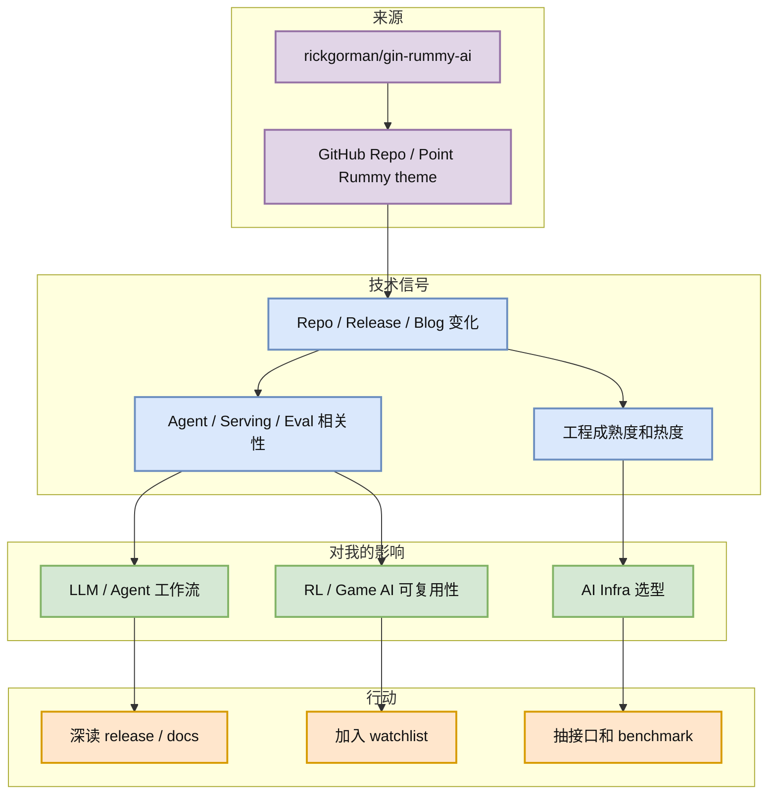
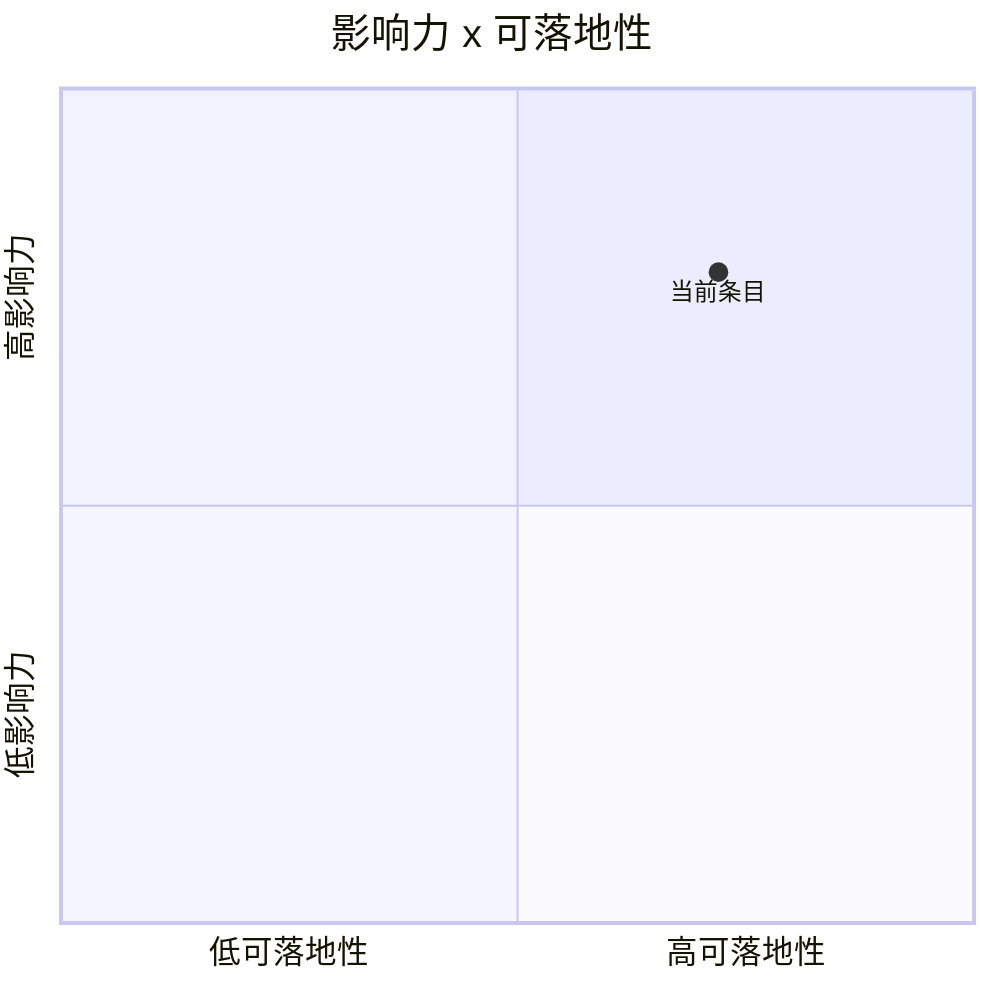

# rickgorman/gin-rummy-ai

> 类型：GitHub
> 大类：GitHub
> 小类：AI Infra / Coding Agent / Research Watchlist
> 推荐等级：可 skim
> 创建日期：2026-08-02
> 原文链接：https://github.com/rickgorman/gin-rummy-ai
> 网页详情：https://github.com/dyt27666-oss/AI-news-report-obsidians/blob/main/GitHub/PointRummy/2026-08-02/rickgorman__gin-rummy-ai.md
> 返回日报：[[Daily/2026-08-02]]

## 一句话结论

A hand-rolled neuroevolution AI for gin rummy.

## TL;DR

- **它是什么**：rickgorman/gin-rummy-ai 的高相关信号，来源类型为 GitHub Repo / Point Rummy theme。
- **为什么重要**：该项目可用于抽取 Indian Rummy / Gin Rummy 的规则状态机、bot 策略、MCTS/ISMCTS 或 self-play evaluator 思路，但成熟度普遍偏低。
- **和我相关的点**：它影响 AI Infra、LLM serving、agent loop、eval harness 或 RL/game AI 工作流的具体落地判断。
- **建议动作**：先 skim 元信息和 release/repo 动向，再决定是否拉代码或读文档。

## 元信息

| 字段 | 内容 |
|---|---|
| 发布方/来源 | rickgorman/gin-rummy-ai |
| 大厂/实验室 | rickgorman |
| 栏目/来源类型 | GitHub Repo / Point Rummy theme |
| 作者/机构 | rickgorman/gin-rummy-ai |
| 发布时间 | 2026-08-02 扫描；原文以链接页面为准 |
| 原文 | [原文](https://github.com/rickgorman/gin-rummy-ai) |
| 代码 | https://github.com/rickgorman/gin-rummy-ai |
| PDF | 未发现 |
| 标签 | #point-rummy #game-ai |

## 信息压缩图示

### 主图：信号到行动

### 辅助图：影响力 x 可落地性

## 专业解读

该项目可用于抽取 Indian Rummy / Gin Rummy 的规则状态机、bot 策略、MCTS/ISMCTS 或 self-play evaluator 思路，但成熟度普遍偏低。 对 AI Infra 工程师来说，关键不只是“这个项目热”，而是它是否改变了 serving runtime、agent loop、权限模型、上下文管理、评测 harness 或训练/推理成本结构。今天这条被放入详情页，是因为它能映射到用户日常关心的工程决策：是否值得试用、是否值得跟 release、是否能抽象成内部工具链或研究路线。

## 通俗解释

可以把它理解成一个“方向信号”：外部生态正在把某类能力做成更标准的工具或流程。我们不需要马上迁移，但需要知道它在哪个环节可能替代手工流程、提升吞吐，或暴露新的风险。

## 关键机制拆解

| 机制 | 解决的问题 | 为什么有效 | 可能的坑 |
|---|---|---|---|
| 规则状态机 | 建模牌局和计分 | 可迁移到业务环境 | 方言规则差异大 |
| AI opponent | 提供 bot baseline | 便于做 self-play | 策略可能很弱 |
| Evaluator | 测试出牌质量 | 可形成离线 benchmark | 需要业务规则校验 |

## 对我的影响

| 维度 | 影响 | 建议动作 |
|---|---|---|
| AI Infra | 影响 runtime / serving / tooling 选型判断 | 看 release diff、benchmark、部署约束 |
| LLM 工程 | 影响 agent、上下文、工具调用或模型集成方式 | 对比现有 CLI/TUI 和 IDE 流程 |
| RL / Game AI | 可借鉴 eval loop、模拟环境或策略测试结构 | 只抽可复用接口，不直接依赖低成熟实现 |
| Agent / Eval | 可能影响 harness、权限和可观测性设计 | 加入 watchlist，按周复盘 |

## 可信度与局限性

- 证据强度：中等；GitHub direct metadata 高可信，但不是完整全网搜索。
- 局限性：今日 GitHub Search 已 403 rate limit，大榜单为 watched-repo fallback。
- 潜在风险：star 增长不等于生产成熟，release 标题也不等于功能稳定。
- 还需要确认：具体 release note、benchmark 和兼容性变更。

## 我应该如何跟进

1. 打开原文确认 release / docs 中是否涉及权限、上下文、MCP、scheduler 或 benchmark。
2. 若与当前项目相关，拉最小 demo 验证接口和依赖。
3. 继续观察 3-7 天 star / issue / release 变化，避免被短期热度误导。

## 相关链接

- 原文：https://github.com/rickgorman/gin-rummy-ai
- 网页详情：https://github.com/dyt27666-oss/AI-news-report-obsidians/blob/main/GitHub/PointRummy/2026-08-02/rickgorman__gin-rummy-ai.md
- 相关卡片：[[Daily/2026-08-02]]

## 标签

#ai-radar #point-rummy #game-ai
