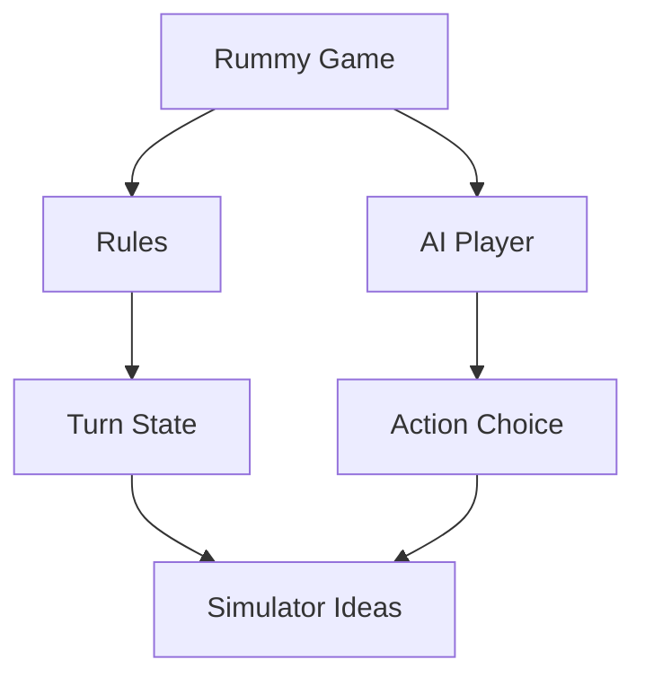

# SCFlanagan/Rummy

> 日期：2026-08-08  
> 来源：GitHub Point Rummy scan  
> 原文：https://github.com/SCFlanagan/Rummy

## 一句话结论
经典 Rummy recreation + AI player，可作为 low-confidence bot/规则样例。

## 跟进建议
只抽取规则和 bot baseline idea；代码质量、测试覆盖和许可证需人工确认。

#ai-radar #point-rummy
