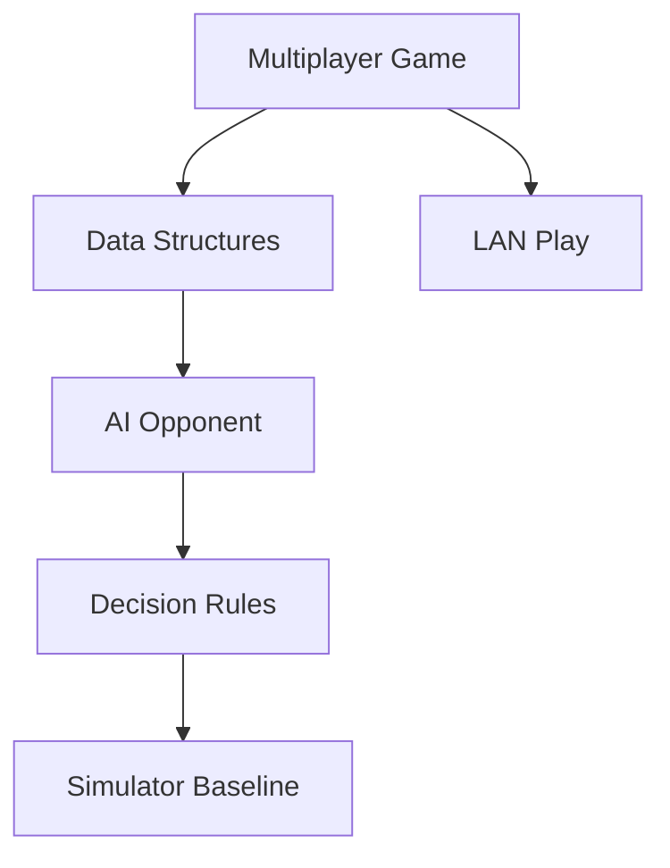

# abubakarmunir712/dsa-final-project

> 日期：2026-08-08  
> 来源：GitHub Point Rummy scan  
> 原文：https://github.com/abubakarmunir712/dsa-final-project

## 一句话结论
Python multiplayer Indian Rummy + AI opponents，低 star 但对规则/AI opponent 雏形有参考价值。

## 业务可用性
适合抽样看状态表示和 AI opponent 接口；生产采用前必须重写测试和规则校验。

#ai-radar #point-rummy
