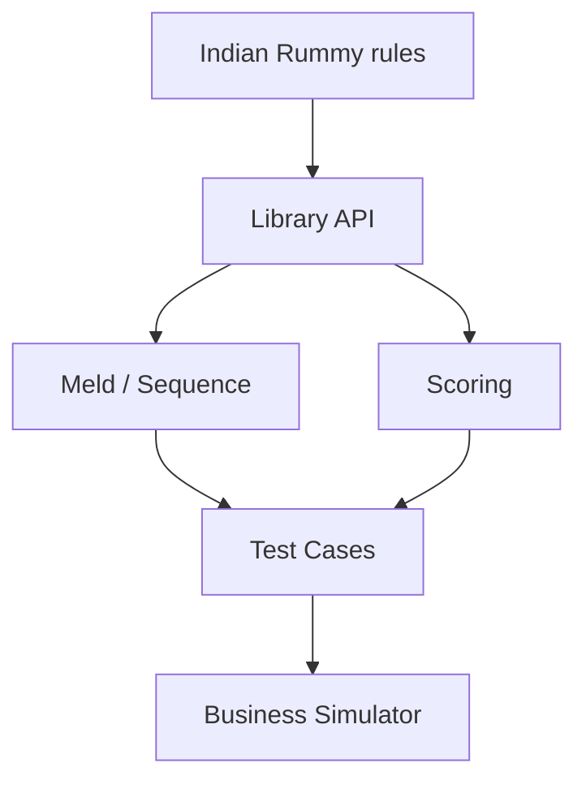

# mudont/indian-rummy

> 日期：2026-08-08  
> 来源：GitHub Point Rummy scan  
> 原文：https://github.com/mudont/indian-rummy

## 一句话结论
TypeScript Indian Rummy library，可作为规则建模和测试用例抽取候选，但 star 低，需要代码审查。

## 业务可用性
| 方向 | 判断 |
|---|---|
| 规则引擎 | 可抽样参考 |
| Bot / RL | 暂无高置信 |
| 生产复用 | 不建议直接采用 |

#ai-radar #point-rummy
