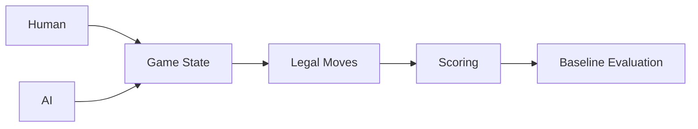

# rawbeen248/Gin-Rummy-AI-vs-Human

> 日期：2026-08-08  
> 来源：GitHub Point Rummy scan  
> 原文：https://github.com/rawbeen248/Gin-Rummy-AI-vs-Human

## 一句话结论
Python Gin Rummy AI vs Human simulator，可作为人机对战 baseline 参考。

## 跟进建议
检查 legal action、reward、终局评分是否可迁移到 Point Rummy。

#ai-radar #point-rummy
