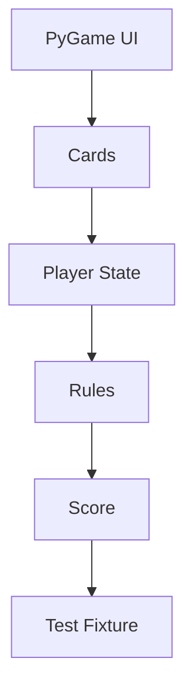

# vahsek300501/Indian-Rummy-

> 日期：2026-08-08  
> 来源：GitHub Point Rummy scan  
> 原文：https://github.com/vahsek300501/Indian-Rummy-

## 一句话结论
Python/PyGame Indian Rummy 项目，适合抽取 UI 状态和基础规则边界。

## 跟进建议
人工检查规则完整性、drop/show/joker 等 Indian Rummy 业务差异。

#ai-radar #point-rummy
