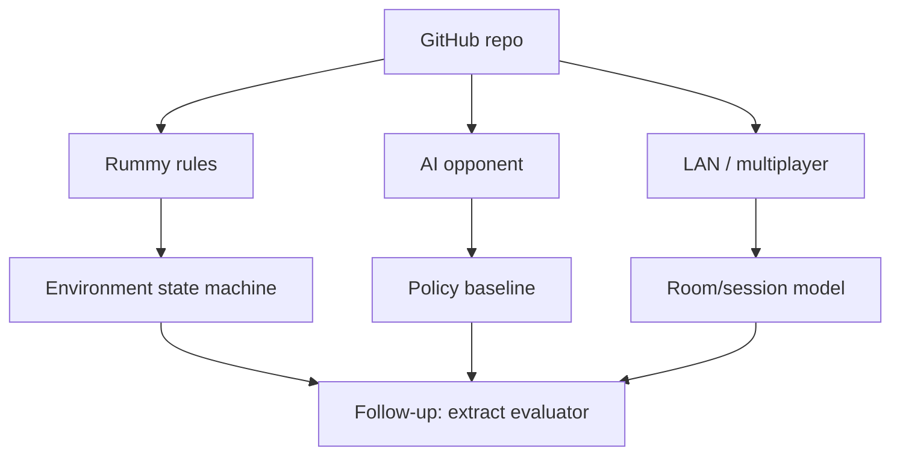

# abubakarmunir712/dsa-final-project

> Type: GitHub detail
> Date: 2026-08-09
> Source: https://github.com/abubakarmunir712/dsa-final-project
> Back: [[Daily/2026-08-09]]

## One-line takeaway

Small Indian Rummy prototype with AI opponent and LAN-play wording; useful as a low-confidence rules and bot reference, not production code.

## Mermaid overview

## Why it matters

For Point Rummy work, the actionable value is to inspect how the repo models cards, turns, scoring, and AI decisions. Treat it as a pattern source only.

## Follow-up

- Check code organization and rule completeness.
- Extract observation/action/reward ideas if present.
- Do not use as production baseline without tests.

#ai-radar #point-rummy #github
