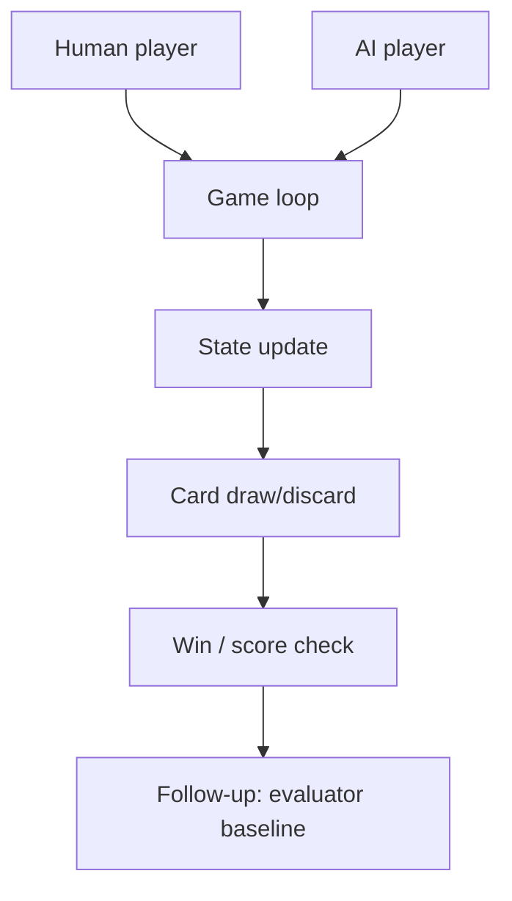

# rawbeen248/Gin-Rummy-AI-vs-Human

> Type: GitHub detail
> Date: 2026-08-09
> Source: https://github.com/rawbeen248/Gin-Rummy-AI-vs-Human
> Back: [[Daily/2026-08-09]]

## One-line takeaway

Small Gin Rummy AI-vs-human implementation; useful for studying basic interaction loops and opponent logic.

## Mermaid overview

## Impact

Use this as a low-confidence example for Point Rummy interaction design. The main value is not stars, but concrete state transitions and AI move hooks.

#ai-radar #point-rummy #github
